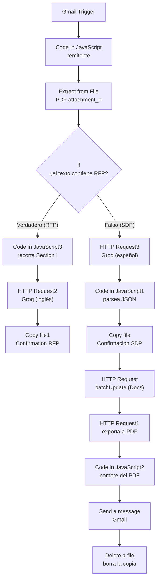

# Aceptación de invitación (Mejorado) — Workflow de n8n

Workflow de n8n que responde automáticamente a las invitaciones a procesos de selección o licitación que llegan por correo: lee el PDF de la invitación, extrae sus datos con IA, genera la carta de confirmación a partir de una plantilla de Google Docs y, en el caso de las invitaciones en español (SDP), la exporta a PDF y la envía por correo al remitente.

> **Autor:** Omar León Montiel  
> **Nombre del workflow en n8n:** Aceptación de invitacion  
> **Estado en el export:** inactivo (active: false)  
> **Nodos:** 15  
> **Última actualización de esta documentación:** 6 de octubre de 2026

---

## Tabla de contenido

1. [Objetivo](#1-objetivo)
2. [Visión general](#2-visión-general)
3. [Tecnologías y servicios](#3-tecnologías-y-servicios)
4. [Datos externos que usa el workflow](#4-datos-externos-que-usa-el-workflow)
5. [Diagrama](#5-diagrama)
6. [Descripción detallada de cada nodo](#6-descripción-detallada-de-cada-nodo)
7. [Tabla completa de conexiones](#7-tabla-completa-de-conexiones)
8. [Credenciales requeridas](#8-credenciales-requeridas)
9. [Configuración del workflow](#9-configuración-del-workflow)
10. [Valores a configurar](#10-valores-a-configurar)
11. [Cómo importar y poner en marcha](#11-cómo-importar-y-poner-en-marcha)

---

## 1. Objetivo

- Detectar en Gmail los correos con una invitación adjunta (nombre de archivo con `invitación` o `RFP`).
- Extraer del PDF los datos clave de la invitación: destinatario, institución, códigos de proceso y de proyecto, tipo de solicitud y documentos recibidos.
- Generar la **carta de confirmación** copiando una plantilla de Google Docs y reemplazando sus marcadores.
- Para invitaciones en español (**SDP**): exportar la carta a PDF, enviarla por correo al remitente y eliminar el documento temporal.
- Para invitaciones en inglés (**RFP**): extraer los datos y crear la copia de la plantilla de respuesta.

## 2. Visión general

| Etapa | Descripción |
|---|---|
| 1. Recepción | `Gmail Trigger` consulta la bandeja cada minuto y descarga los adjuntos |
| 2. Remitente | `Code in JavaScript` guarda el remitente del correo |
| 3. Lectura | `Extract from File` extrae el texto del primer adjunto PDF |
| 4. Decisión | `If` revisa si el texto contiene `RFP` (sin distinguir mayúsculas) |
| 5a. Rama **RFP** (inglés) | Recorta la *Section I* de la invitación, extrae datos con Groq y copia la plantilla `Confirmation RFP` |
| 5b. Rama **SDP** (español) | Extrae datos con Groq, copia la plantilla `Confirmación SDP`, reemplaza marcadores, exporta a PDF, envía el correo y elimina la copia temporal |

**Criterio de la bifurcación (`If`):**

| Resultado | Condición | Rama |
|---|---|---|
| Verdadero | El texto del PDF, en mayúsculas, contiene `RFP` | RFP (inglés) |
| Falso | No contiene `RFP` | SDP (español) |

## 3. Tecnologías y servicios

| Componente | Uso |
|---|---|
| **n8n** | Orquestación (versión de ejecución `v1`) |
| **Gmail** (trigger y nodo Gmail) | Recepción de invitaciones y envío de la confirmación |
| **Google Drive** (nodo y API REST) | Copia de plantillas, exportación a PDF y eliminación del documento temporal |
| **Google Docs API** (REST) | Reemplazo de marcadores en la carta |
| **Groq** (API compatible con OpenAI) | Extracción de datos con el modelo `openai/gpt-oss-120b` |
| **JavaScript** (nodos Code) | Remitente, recorte del texto, parseo de la respuesta, nombre del PDF |

## 4. Datos externos que usa el workflow

### 4.1 Plantilla `Confirmación SDP` (Google Doc)

Documento con marcadores `{{clave}}`. El workflow reemplaza **cada clave** del objeto de datos por su valor.

| Marcador | Origen |
|---|---|
| `{{nombreDestinatario}}` | Nombre de quien firma la invitación |
| `{{cargoDestinatario}}` | Cargo de esa persona |
| `{{departamentoDestinatario}}` | Departamento, unidad o división |
| `{{institucionDestinatario}}` | Institución que emite la invitación |
| `{{codigoTC}}` | Código de referencia del proceso (por ejemplo `FC-SBCC-PGCS-2025-004`) |
| `{{codigoATNOC}}` | Código ATN/OC, si aparece |
| `{{numeroProyecto}}` | Código del proyecto (por ejemplo `DR-L1154`) |
| `{{numeroPrestamo}}` | Número de préstamo (por ejemplo `5745/OC-DR`) |
| `{{nombreProyecto}}` | Nombre del proyecto |
| `{{tipoSolicitud}}` | Tipo de propuesta que se solicita |
| `{{documentosRecibidos}}` | Lista de documentos, con formato `Sección I - ...`, `Sección II - ...` (numeración romana, un renglón por documento) |
| `{{remitente}}` | Campo `From` completo del correo |
| `{{emailRemitente}}` | Dirección de correo del remitente |
| `{{fecha}}` | Fecha del día en español (por ejemplo `5 de noviembre de 2025`) |

Los valores `null` se reemplazan por texto vacío.

### 4.2 Plantilla `Confirmation RFP` (Google Doc)

Plantilla de respuesta para las invitaciones en inglés. El nombre de la copia es `Confirmation RFP <referenceNumber>` (o `SN` si no hay número). Los datos extraídos para esta rama son:

| Campo | Descripción |
|---|---|
| `recipientName` | Nombre completo de quien firmó o envió la invitación |
| `recipientTitle` | Cargo de esa persona |
| `recipientDepartment` | Departamento, unidad o equipo |
| `institutionName` | Institución u organización |
| `referenceNumber` | Número de referencia del proceso (formato `FC-SBCC-XXXX-2025-001`) |
| `projectNumber` | Número(s) de proyecto (por ejemplo `BZ-L1234` o `ATN/AC-19488-BL`) |
| `documentsReceived` | Secciones listadas en la invitación, excepto la *Section I - Letter of Invitation* |

Además, `Code in JavaScript3` agrega el campo `date` (fecha en inglés, por ejemplo `November 5, 2025`).

## 5. Diagrama



---

## 6. Descripción detallada de cada nodo

### Bloque común

#### 6.1 `Gmail Trigger`

**Tipo:** `gmailTrigger` v1.4 · **Credencial:** Gmail account

| Parámetro | Valor |
|---|---|
| Frecuencia de consulta | Cada minuto (`everyMinute`) |
| `simple` | `false` (mensaje completo) |
| Filtro (`q`) | `has:attachment (filename:invitación OR filename:RFP)` |
| Opciones | `downloadAttachments: true` — los adjuntos quedan como binarios (`attachment_0`, …) |

**Siguiente:** `Code in JavaScript`.

#### 6.2 `Code in JavaScript`

**Tipo:** `code` v2 (JavaScript)

```javascript
const headers = $json.payload?.headers || $json.headers || {};
const remitente = headers.from || headers.From || null;

return {
  json: {
    ...$json,
    remitente
  },
  binary: $binary
};
```

Busca el remitente en `payload.headers` o `headers` (`from` / `From`) y lo agrega como campo `remitente`; conserva el binario. **Siguiente:** `Extract from File`.

#### 6.3 `Extract from File`

**Tipo:** `extractFromFile` v1.1

| Parámetro | Valor |
|---|---|
| Operación | `pdf` |
| Propiedad binaria | `attachment_0` |

Extrae el texto del PDF en el campo `text`. **Siguiente:** `If`.

#### 6.4 `If`

**Tipo:** `if` v2.3 (validación estricta, distingue mayúsculas; combinador **OR**)

| Condición | Valor |
|---|---|
| Valor izquierdo | `{{ $json.text.toUpperCase() }}` |
| Operador | `contiene` (`contains`) |
| Valor derecho | `RFP` |

| Salida | Destino |
|---|---|
| Verdadero | `Code in JavaScript3` (rama RFP) |
| Falso | `HTTP Request3` (rama SDP) |

---

### Rama RFP (invitaciones en inglés)

#### 6.5 `Code in JavaScript3`

**Tipo:** `code` v2 (JavaScript)

```javascript
const textoCompleto = $json.text;
const LONGITUD_EXTRACCION = 6000; // ~1500 tokens

// ============================================
// 1. BUSCAR "SECTION I. LETTER OF INVITATION"
// ============================================
const inicioRegex = /(PART\s*(I|ONE)\b[\s\S]{0,80}?)?SECTION\s*(I|1)\b\.?\s*[-–—:]?\s*LETTER\s*OF\s*INVITATION/gi;

// Confirmamos positivamente que es el encabezado real: debe estar seguido,
// a corta distancia, de marcadores típicos del inicio de una carta de invitación real
function pareceEncabezadoReal(textoSiguiente) {
  const fragmento = textoSiguiente.slice(0, 400);
  return /RFP\s*No|Loan\s*No|Process\s*ID|Ref(erence)?\s*No|Dear\s+(Mr|Ms|Mrs|Sir|Madam)|Dear\s+Sir\s*(or|\/)\s*Madam|To\s+Whom\s+It\s+May\s+Concern|Ladies\s+and\s+Gentlemen/i.test(fragmento);
}

let match;
let inicioIndex = -1;
const intentos = []; // log de cada candidato evaluado

while ((match = inicioRegex.exec(textoCompleto)) !== null) {
  const despues = textoCompleto.slice(
    match.index + match[0].length,
    match.index + match[0].length + 400
  );
  const confirmado = pareceEncabezadoReal(despues);

  intentos.push({
    posicion: match.index,
    textoEncontrado: match[0].replace(/\s+/g, ' ').trim(),
    confirmado
  });

  console.log(
    `[Code in JavaScript3] Candidato en posición ${match.index}: "${match[0].replace(/\s+/g, ' ').trim()}" -> confirmado=${confirmado}`
  );

  if (confirmado) {
    inicioIndex = match.index;
    break;
  }
}

// ============================================
// 2. FECHA EN INGLÉS (calculada una sola vez)
// ============================================
const fechaIngles = $now.setLocale('en-us').toFormat("LLLL d, yyyy"); // ej: "November 5, 2025"

// ============================================
// 3. EXTRAER BLOQUE DE TAMAÑO FIJO DESDE AHÍ
// ============================================
if (inicioIndex === -1) {
  console.log(
    `[Code in JavaScript3] No se confirmó ningún encabezado (${intentos.length} candidato(s) evaluado(s)). Usando fallback de los primeros ${LONGITUD_EXTRACCION} caracteres.`
  );
  return {
    json: {
      ...$json,
      text: textoCompleto.slice(0, LONGITUD_EXTRACCION),
      seccionEncontrada: false,
      debugCandidatos: intentos,
      date: fechaIngles
    }
  };
}

console.log(
  `[Code in JavaScript3] Encabezado confirmado en posición ${inicioIndex}. Extrayendo ${LONGITUD_EXTRACCION} caracteres desde ahí.`
);

const seccionI = textoCompleto.slice(inicioIndex, inicioIndex + LONGITUD_EXTRACCION);

return {
  json: {
    ...$json,
    text: seccionI.trim(),
    seccionEncontrada: true,
    debugCandidatos: intentos,
    date: fechaIngles
  }
};
```

| Paso | Descripción |
|---|---|
| 1 | Busca con una expresión regular el encabezado `SECTION I. LETTER OF INVITATION` (admite `PART I/ONE` previo, `SECTION 1`, y separadores `-`, `–`, `—`, `:`) |
| 2 | Confirma que es el encabezado real: en los 400 caracteres siguientes debe haber marcadores como `RFP No`, `Loan No`, `Process ID`, `Reference No`, `Dear Mr/Ms/Mrs/Sir/Madam`, `To Whom It May Concern` o `Ladies and Gentlemen` |
| 3 | Calcula la fecha en inglés (`LLLL d, yyyy`) en el campo `date` |
| 4 | Si lo confirma, toma **6000 caracteres** desde ese punto como `text`; si no, usa los **primeros 6000 caracteres** del documento |
| 5 | Devuelve los campos originales más `text`, `seccionEncontrada` (booleano), `debugCandidatos` (candidatos evaluados) y `date` |

Registra en consola cada candidato evaluado. **Siguiente:** `HTTP Request2`.

#### 6.6 `HTTP Request2`

**Tipo:** `httpRequest` v4.5

| Parámetro | Valor |
|---|---|
| Método | `POST` |
| URL | `https://api.groq.com/openai/v1/chat/completions` |
| Cabecera | `Authorization: Bearer <GROQ_API_KEY>` |
| Cuerpo (JSON) | Ver abajo |

Modelo `openai/gpt-oss-120b`, `temperature: 0`, `response_format: json_object`. El mensaje de sistema pide extraer los datos **solo de la Sección I** y define las claves `recipientName`, `recipientTitle`, `recipientDepartment`, `institutionName`, `referenceNumber`, `projectNumber` y `documentsReceived`, con reglas para separar el número de proyecto del de referencia (campo `RFP No.`), ignorar `Loan No.` y listar las secciones del RFP sin la *Section I*. El mensaje de usuario es `{{ $json.text }}`.

```javascript
={{ JSON.stringify({
  model: "openai/gpt-oss-120b",
  temperature: 0,
  response_format: { type: "json_object" },
  messages: [
    {
      role: "system",
      content: "You are an assistant that extracts structured data from Request for Proposals (RFP) invitation letters, in order to fill a REPLY letter addressed back to the person who sent the invitation. Extract data ONLY from Section I of the document — ignore any other section. Return ONLY a JSON object with this exact shape, no extra text, no markdown, no explanations: {\"recipientName\": \"the full name of the person who SIGNED or SENT the invitation letter (the contact person to reply to) — usually found either in a letterhead/contact block near the top of the letter, OR near the closing signature (e.g. after 'Yours sincerely,' / 'Sincerely,'), or null if no individual name appears\", \"recipientTitle\": \"the job title of that same person (e.g. 'Project Manager', 'Projects Assistant'), found next to their name, or null\", \"recipientDepartment\": \"the department, unit, or team of that same person (e.g. 'Central Executing Unit', 'CSD/HUD'), or null\", \"institutionName\": \"the name of the overall institution or organization that person belongs to (e.g. 'Ministry of Finance', 'Inter-American Development Bank'), or null\", \"referenceNumber\": \"reference number of the selection process, format like FC-SBCC-XXXX-2025-001, or null if not found\", \"projectNumber\": \"the project number(s), format like BZ-L1234 or ATN/AC-19488-BL, or null if not found\", \"documentsReceived\": [\"array of strings, each one a section title mentioned in the invitation's list of RFP sections\"]}. Use exactly these key names and do not omit any. Do not invent data that is not mentioned in the text. If a field does not appear in Section I, use null (or an empty array for documentsReceived). IMPORTANT for referenceNumber/projectNumber: The field labeled 'RFP No.' often contains TWO separate identifiers written together, separated by a space, such as 'BL-L1042 P00036'. In that case, the FIRST part (matching a country-code + loan-number pattern like XX-L#### or BZ-L1234) is the projectNumber, and the SECOND part is the referenceNumber. Do not merge them into a single field. Do NOT use the 'Loan No.' value for either field — that is a different, unrelated identifier. If instead a single project code or multiple codes separated by ';' appear (e.g. 'ATN/AC-19488-BL; ATN/OC-19487-BL'), use the full string as projectNumber. IMPORTANT for documentsReceived: The letter typically contains a numbered/labeled list such as 'Section I - Letter of Invitation', 'Section II - Instructions to Consultants', 'Section III - Data Sheet', etc. Find that exact list. Include EVERY section from it EXCEPT 'Section I - Letter of Invitation' itself (since that is the cover letter being replied to, not an attached document). Use only the text AFTER the dash/hyphen for each entry (e.g. 'Instructions to Consultants', not 'Section II - Instructions to Consultants'). Keep them in the same order as they appear in that list. Do not add documents mentioned elsewhere in the letter that are not part of this specific numbered list (e.g. do not add 'Terms of Reference' twice if it already appears as a numbered section, and do not add standalone forms mentioned in other paragraphs unless they are part of the numbered list)."
    },
    {
      role: "user",
      content: $json.text
    }
  ]
}) }}
```

**Siguiente:** `Copy file1`.

#### 6.7 `Copy file1`

**Tipo:** `googleDrive` v3 · **Credencial:** Google Drive account

| Parámetro | Valor |
|---|---|
| Operación | `copy` |
| Archivo a copiar | `<ID_PLANTILLA_RFP>` (plantilla `Confirmation RFP`, modo `id`) |
| Nombre | `Confirmation RFP {{ $json.referenceNumber \|\| 'SN' }}` |
| Opciones | Ninguna |

Es el último nodo de esta rama.

---

### Rama SDP (invitaciones en español)

#### 6.8 `HTTP Request3`

**Tipo:** `httpRequest` v4.5

| Parámetro | Valor |
|---|---|
| Método | `POST` |
| URL | `https://api.groq.com/openai/v1/chat/completions` |
| Cabecera | `Authorization: Bearer <GROQ_API_KEY>` |
| Cuerpo (JSON) | Ver abajo |

Modelo `openai/gpt-oss-120b`, `temperature: 0`, `response_format: json_object`. El mensaje de sistema pide devolver únicamente un JSON con las claves `nombreDestinatario`, `cargoDestinatario`, `departamentoDestinatario`, `institucionDestinatario`, `codigoTC`, `codigoATNOC`, `numeroProyecto`, `numeroPrestamo`, `nombreProyecto`, `tipoSolicitud` y `documentosRecibidos`; indica que `numeroProyecto` y `numeroPrestamo` son datos distintos, que los datos del destinatario corresponden a quien firma o emite la invitación, que se use `null` (o arreglo vacío) cuando un dato no aparezca y que no se inventen datos. El mensaje de usuario es `{{ $json.text }}`.

```javascript
={{ JSON.stringify({
  model: "openai/gpt-oss-120b",
  temperature: 0,
  response_format: { type: "json_object" },
  messages: [
    {
      role: "system",
      content: "Eres un asistente que extrae datos estructurados de cartas de invitación a procesos de licitación o selección de consultores. Analiza el texto proporcionado y devuelve SOLO un objeto JSON con esta forma exacta, sin texto adicional, sin markdown, sin explicaciones: {\"nombreDestinatario\": \"string o null\", \"cargoDestinatario\": \"cargo de la persona que firma la carta de invitación (ej. Coordinador de Adquisiciones), o null si no aparece\", \"departamentoDestinatario\": \"departamento, unidad o división de esa misma persona, o null si no aparece\", \"institucionDestinatario\": \"institución u organización que emite la invitación, o null si no aparece\", \"codigoTC\": \"código de referencia del proceso, formato tipo FC-SBCC-PGCS-2025-004, o null si no aparece\", \"codigoATNOC\": \"string o null\", \"numeroProyecto\": \"el código entre paréntesis que acompaña al nombre del proyecto, formato tipo XX-Xnnnn (ej. DR-L1154), o null si no aparece\", \"numeroPrestamo\": \"el número de préstamo del banco, formato tipo nnnn/OC-XX (ej. 5745/OC-DR), o null si no aparece\", \"nombreProyecto\": \"string o null\", \"tipoSolicitud\": \"string describiendo qué tipo de propuesta se solicita\", \"documentosRecibidos\": [\"array de strings, cada uno un documento o sección mencionada en la invitación\"]}. Usa exactamente esos nombres de clave y no omitas ninguna. numeroProyecto y numeroPrestamo son datos DISTINTOS y no deben confundirse entre sí. cargoDestinatario, departamentoDestinatario e institucionDestinatario corresponden a quien firma o emite la invitación, no a los consultores que la reciben. Si algún dato no aparece en el texto, usa null (o arreglo vacío para documentosRecibidos). No inventes datos que no estén mencionados en el texto."
    },
    {
      role: "user",
      content: $json.text
    }
  ]
}) }}
```

**Siguiente:** `Code in JavaScript1`.

#### 6.9 `Code in JavaScript1`

**Tipo:** `code` v2 (JavaScript)

```javascript
const raw = $json.choices[0].message.content;
const datos = JSON.parse(raw);

const remitenteCompleto = $('Code in JavaScript').item.json.remitente;
const match = remitenteCompleto.match(/<(.+)>/);
const emailRemitente = match ? match[1] : remitenteCompleto;

return {
  json: {
    ...datos,
    remitente: remitenteCompleto,
    emailRemitente
  }
};
```

Interpreta la respuesta de Groq como JSON y agrega `remitente` (campo `From` completo, tomado de `Code in JavaScript`) y `emailRemitente` (la dirección dentro de `<...>`, o el valor completo si no hay). **Siguiente:** `Copy file`.

#### 6.10 `Copy file`

**Tipo:** `googleDrive` v3 · **Credencial:** Google Drive account

| Parámetro | Valor |
|---|---|
| Operación | `copy` |
| Archivo a copiar | `<ID_PLANTILLA_SDP>` (plantilla `Confirmación SDP`, modo `id`) |
| Nombre | `` ` Confirmación SDP ${$json.codigoTC \|\| 'SN'}` `` (expresión con plantilla de texto) |
| Opciones | Ninguna |

Crea la copia temporal sobre la que se reemplazan los marcadores. **Siguiente:** `HTTP Request`.

#### 6.11 `HTTP Request`

**Tipo:** `httpRequest` v4.5 · Autenticación predefinida: `googleDriveOAuth2Api`

| Parámetro | Valor |
|---|---|
| Método | `POST` |
| URL | `https://docs.googleapis.com/v1/documents/{{ $json.id }}:batchUpdate` |
| Cuerpo (JSON) | Ver abajo |

```javascript
={{ (() => {
  const romano = n => [[10,'X'],[9,'IX'],[5,'V'],[4,'IV'],[1,'I']]
    .reduce((s, [v, r]) => { while (n >= v) { s += r; n -= v; } return s; }, '');

  const datos = {
    ...$('Code in JavaScript1').item.json,
    fecha: $now.setLocale('es').toFormat("d 'de' LLLL 'de' yyyy")
  };

  return JSON.stringify({
    requests: Object.entries(datos).map(([k, v]) => ({
      replaceAllText: {
        containsText: { text: '{' + '{' + k + '}' + '}', matchCase: true },
        replaceText: Array.isArray(v)
          ? v.map((x, i) => `Sección ${romano(i + 1)} - ${x}`).join('\n')
          : String(v ?? '')
      }
    }))
  });
})() }}
```

| Paso | Descripción |
|---|---|
| 1 | Define `romano(n)` para convertir números a numeración romana |
| 2 | Arma `datos` con todos los campos de `Code in JavaScript1` más `fecha` (`d 'de' LLLL 'de' yyyy`, en español) |
| 3 | Genera una solicitud `replaceAllText` por cada clave: busca `{{clave}}` (distingue mayúsculas) |
| 4 | Si el valor es un arreglo, lo convierte en renglones `Sección <romano> - <elemento>`; si es `null` o indefinido, usa texto vacío; en otros casos, el valor como texto |

**Siguiente:** `HTTP Request1`.

#### 6.12 `HTTP Request1`

**Tipo:** `httpRequest` v4.5 · Autenticación predefinida: `googleDriveOAuth2Api`

| Parámetro | Valor |
|---|---|
| Método | `GET` |
| URL | `https://www.googleapis.com/drive/v3/files/{{ $json.documentId }}/export?mimeType=application/pdf` |
| Formato de respuesta | `file` (binario) |

Exporta a PDF la copia ya completada (usa el `documentId` devuelto por `batchUpdate`). **Siguiente:** `Code in JavaScript2`.

#### 6.13 `Code in JavaScript2`

**Tipo:** `code` v2 (JavaScript)

```javascript
const codigo = $('Code in JavaScript1').first().json.codigoTC || 'SN';
const nombre = `Confirmación SDP ${codigo}`.replace(/[\/\\:*?"<>|]/g, '-');

const item = $input.first();
item.binary.data.fileName = `${nombre}.pdf`;
item.binary.data.fileExtension = 'pdf';
item.binary.data.mimeType = 'application/pdf';

return [item];
```

Asigna al binario `data` el nombre `Confirmación SDP <codigoTC>.pdf` (sustituye por `-` los caracteres no permitidos en nombres de archivo; usa `SN` si no hay código), la extensión `pdf` y el tipo `application/pdf`. **Siguiente:** `Send a message`.

#### 6.14 `Send a message`

**Tipo:** `gmail` v2.2 · **Credencial:** Gmail account

| Parámetro | Valor |
|---|---|
| Destinatario | `{{ $('Gmail Trigger').item.json.from.value[0].address }}` (remitente de la invitación) |
| Asunto | `Confirmación SDP {{ $('Code in JavaScript1').item.json.codigoTC }}` |
| Formato del mensaje | HTML |
| Adjunto | Una entrada de adjunto binario con la propiedad predeterminada (el PDF generado) |
| `appendAttribution` | `false` (sin la leyenda "enviado con n8n") |

Cuerpo del mensaje (HTML):

```html
<div style="font-family: Arial, Helvetica, sans-serif; font-size: 14px; color: #222222; line-height: 1.6; max-width: 600px;">

  <p style="margin: 0 0 16px 0;">Estimados señores:</p>

  <p style="margin: 0 0 16px 0;">
    Por medio del presente, confirmamos la recepción de la Solicitud de Propuesta (SDP) y la documentación correspondiente al siguiente proceso de selección:
  </p>

  <table style="border-collapse: collapse; width: 100%; margin: 0 0 16px 0; font-size: 14px;">
    <tr>
      <td style="padding: 8px 12px; background-color: #f2f5f8; border: 1px solid #d9dee3; width: 35%;"><strong>Proceso (TC)</strong></td>
      <td style="padding: 8px 12px; border: 1px solid #d9dee3;">{{ $('Code in JavaScript1').item.json.codigoTC || '-' }}</td>
    </tr>
    <tr>
      <td style="padding: 8px 12px; background-color: #f2f5f8; border: 1px solid #d9dee3;"><strong>Número de proyecto</strong></td>
      <td style="padding: 8px 12px; border: 1px solid #d9dee3;">{{ $('Code in JavaScript1').item.json.numeroProyecto || '-' }}</td>
    </tr>
    <tr>
      <td style="padding: 8px 12px; background-color: #f2f5f8; border: 1px solid #d9dee3;"><strong>Proyecto</strong></td>
      <td style="padding: 8px 12px; border: 1px solid #d9dee3;">{{ $('Code in JavaScript1').item.json.nombreProyecto || '-' }}</td>
    </tr>
  </table>

  <p style="margin: 0 0 16px 0;">
    Adjuntamos a este correo la carta de confirmación en formato PDF. Asimismo, confirmamos que procederemos de acuerdo con las instrucciones proporcionadas a las firmas proponentes.
  </p>

  <p style="margin: 0 0 24px 0;">
    Quedamos atentos a cualquier comentario o indicación adicional.
  </p>

  <p style="margin: 0;">Atentamente,</p>
  <p style="margin: 4px 0 0 0;">
    <strong><NOMBRE_FIRMANTE></strong><br>
    <CARGO_FIRMANTE><br>
    <EMPRESA><br>
    <TELÉFONO> | <CORREO_FIRMANTE>
  </p>

</div>
```

El cuerpo muestra una tabla con `codigoTC`, `numeroProyecto` y `nombreProyecto` (o `-` si no hay valor). **Siguiente:** `Delete a file`.

#### 6.15 `Delete a file`

**Tipo:** `googleDrive` v3 · **Credencial:** Google Drive account

| Parámetro | Valor |
|---|---|
| Operación | `deleteFile` |
| Archivo | `{{ $('Copy file').item.json.id }}` (modo `id`) |

Elimina la copia temporal de la plantilla. Es el último nodo de la rama SDP.

---

## 7. Tabla completa de conexiones

| Origen | Salida | Destino |
|---|---|---|
| `Gmail Trigger` | main | `Code in JavaScript` |
| `Code in JavaScript` | main | `Extract from File` |
| `Extract from File` | main | `If` |
| `HTTP Request3` | main | `Code in JavaScript1` |
| `Code in JavaScript1` | main | `Copy file` |
| `Copy file` | main | `HTTP Request` |
| `HTTP Request` | main | `HTTP Request1` |
| `HTTP Request1` | main | `Code in JavaScript2` |
| `Code in JavaScript2` | main | `Send a message` |
| `Send a message` | main | `Delete a file` |
| `If` | Verdadero | `Code in JavaScript3` |
| `If` | Falso | `HTTP Request3` |
| `Code in JavaScript3` | main | `HTTP Request2` |
| `HTTP Request2` | main | `Copy file1` |

## 8. Credenciales requeridas

Las credenciales **no se incluyen** en el repositorio; cada persona debe crear las suyas en n8n.

| Credencial en n8n | Tipo | Nodos que la usan |
|---|---|---|
| `Gmail account` | `gmailOAuth2` | `Gmail Trigger`, `Send a message` |
| `Google Drive account` | `googleDriveOAuth2Api` | `Copy file`, `HTTP Request`, `HTTP Request1`, `Delete a file`, `Copy file1` |

**Clave de API configurada directamente en los nodos HTTP** (no es una credencial de n8n):

| Servicio | Nodos | Cómo se envía |
|---|---|---|
| Groq (`<GROQ_API_KEY>`) | `HTTP Request2`, `HTTP Request3` | Cabecera `Authorization: Bearer <GROQ_API_KEY>` |

Los nodos `HTTP Request` y `HTTP Request1` llaman a la API de Google Docs y a la de Google Drive con la autenticación predefinida `googleDriveOAuth2Api`.

## 9. Configuración del workflow

| Ajuste | Valor |
|---|---|
| `active` | `false` |
| `executionOrder` | `v1` |
| `binaryMode` | `separate` |
| `timeSavedMode` | `fixed` |
| `errorWorkflow` | `<ID_ERROR_WORKFLOW>` |
| `timezone` | `America/Mexico_City` |
| `callerPolicy` | `workflowsFromSameOwner` |
| `availableInMCP` | `false` |
| `pinData` | vacío |
| `tags` | ninguna |

## 10. Valores a configurar

| Marcador | Qué es | Dónde se usa |
|---|---|---|
| `<ID_PLANTILLA_SDP>` | Google Doc plantilla `Confirmación SDP` | `Copy file` |
| `<ID_PLANTILLA_RFP>` | Google Doc plantilla `Confirmation RFP` | `Copy file1` |
| `<GROQ_API_KEY>` | Clave de la API de Groq | `HTTP Request2`, `HTTP Request3` |
| `<NOMBRE_FIRMANTE>`, `<CARGO_FIRMANTE>`, `<EMPRESA>`, `<TELÉFONO>`, `<CORREO_FIRMANTE>` | Datos de la firma del correo de confirmación | `Send a message` |
| `<ID_ERROR_WORKFLOW>` | Workflow de errores | Configuración del workflow |

## 11. Cómo importar y poner en marcha

1. En n8n, ve a **Workflows → Import from file** y selecciona `workflows/Aceptación_de_invitacion_Mejorado.json`.
2. Crea y asigna las credenciales de la [sección 8](#8-credenciales-requeridas): Gmail y Google Drive.
3. Reemplaza la clave de Groq en `HTTP Request2` y `HTTP Request3`.
4. Crea las plantillas de Google Docs con los marcadores de la [sección 4.1](#41-plantilla-confirmación-sdp-google-doc) y pega sus IDs en `Copy file` y `Copy file1`.
5. Completa la firma en el cuerpo del correo de `Send a message`.
6. Activa el workflow (interruptor *Active*) para que `Gmail Trigger` empiece a consultar la bandeja cada minuto.
