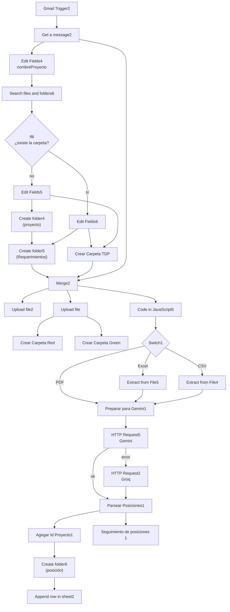
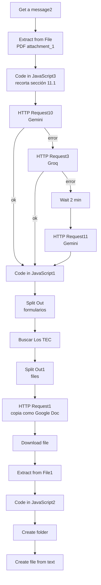

# Automatización de CVs — Workflow de n8n

Workflow de n8n que automatiza el proceso de reclutamiento por correo electrónico: registra proyectos y sus posiciones a partir de los requerimientos recibidos, organiza todo en Google Drive y Google Sheets, recibe los CVs de los candidatos, los evalúa con IA contra el perfil solicitado, genera una ficha profesional en Google Docs a partir de una plantilla y notifica por Telegram.

> **Autor:** Omar León Montiel  
> **Nombre del workflow en n8n:** Automatización de CVs  
> **Estado en el export:** activo (`active: true`)  
> **Nodos:** 87 nodos funcionales y 1 nota adhesiva (88 en total)  
> **Última actualización de esta documentación:** 6 de octubre de 2026

---

## Tabla de contenido

1. [Objetivo](#1-objetivo)
2. [Visión general](#2-visión-general)
3. [Tecnologías y servicios](#3-tecnologías-y-servicios)
4. [Datos externos que usa el workflow](#4-datos-externos-que-usa-el-workflow)
5. [Diagramas](#5-diagramas)
6. [Flujo A — Alta de proyecto y posiciones](#6-flujo-a--alta-de-proyecto-y-posiciones)
7. [Subflujo de licitación — Formularios TEC](#7-subflujo-de-licitación--formularios-tec)
8. [Flujo B — Recepción y evaluación de CVs](#8-flujo-b--recepción-y-evaluación-de-cvs)
9. [Tabla completa de conexiones](#9-tabla-completa-de-conexiones)
10. [Credenciales requeridas](#10-credenciales-requeridas)
11. [Configuración del workflow](#11-configuración-del-workflow)
12. [Valores a configurar](#12-valores-a-configurar)
13. [Cómo importar y poner en marcha](#13-cómo-importar-y-poner-en-marcha)

---

## 1. Objetivo

- Recibir por correo el **nombre de un proyecto** y sus **archivos de requerimientos**, crear la estructura de carpetas en Google Drive y registrar cada posición solicitada.
- Recibir por correo los **CVs** de los candidatos (con proyecto y posición en el asunto) y guardarlos en la carpeta de la posición correspondiente.
- **Evaluar con IA** a cada candidato contra el perfil solicitado para su posición y extraer los datos de su CV.
- Para los candidatos aptos: marcar la posición como cubierta, generar una **ficha profesional** en Google Docs a partir de una plantilla y enviar una notificación por Telegram.
- Avisar por Telegram cuando **todas las posiciones** de un proyecto estén cubiertas.
- A partir del documento de licitación adjunto, identificar los **formularios TEC** requeridos y consolidar sus textos en un solo archivo.

## 2. Visión general

El workflow contiene dos disparadores de Gmail independientes y un subflujo adicional que parte del primero. La nota adhesiva del propio workflow (`Sticky Note1`) describe el **Flujo A**:

> **Flujo A.** Donde se recibe lo siguiente: 1.- Nombre del proyecto. 2.- Archivos requerimientos. Posteriormente se crean las carpetas con todos los roles de trabajo donde se guardarán los diferentes CV.

| Bloque | Disparador | Qué hace | Nodos |
|---|---|---|---|
| **Flujo A** | `Gmail Trigger2` | Crea la carpeta del proyecto, guarda los requerimientos, extrae las posiciones con IA, crea una subcarpeta por posición y registra todo en Google Sheets | `Gmail Trigger2` … `Append row in sheet2`, `Seguimiento de posiciones 1` |
| **Subflujo de licitación** | `Get a message2` (segundo adjunto) | Crea la carpeta `TDP` con el segundo adjunto, identifica con IA los formularios TEC y consolida su texto | `Crear Carpeta TDP` … `Create file from text` |
| **Flujo B** | `Gmail Trigger3` | Guarda el CV, lo evalúa con IA, actualiza el estado de la posición, genera la ficha en Google Docs y notifica por Telegram | `Gmail Trigger3` … `Send a text message1` |

**Formato de los asuntos de correo**

| Correo | Filtro de Gmail | Formato esperado del asunto |
|---|---|---|
| Proyecto (Flujo A) | `has:attachment subject:"Proyecto:"` | `Proyecto: <nombre del proyecto>` |
| CV (Flujo B) | `has:attachment subject:"Proyecto:" subject:"Posición:"` | `Proyecto: <nombre del proyecto> - Posición: <nombre de la posición>` |

## 3. Tecnologías y servicios

| Componente | Uso |
|---|---|
| **n8n** | Orquestación (versión de ejecución `v1`) |
| **Gmail** (trigger y nodo Gmail) | Recepción de proyectos y CVs, descarga de adjuntos |
| **Google Drive** (nodo y API REST) | Carpetas, subida/copia/descarga de archivos, búsqueda de formularios TEC |
| **Google Sheets** | Registro de proyectos, posiciones, candidatos y estado de cobertura |
| **Google Docs API** (REST) | Reemplazo de marcadores y ajuste de tablas en la ficha generada |
| **Google Gemini** (API REST) | Extracción de posiciones, evaluación de CVs y extracción de formularios TEC. Modelos configurados: `gemini-3.6-flash`, `gemini-2.5-flash`, `gemini-3.5-flash-lite` |
| **Groq** (API compatible con OpenAI) | Modelo de respaldo `openai/gpt-oss-120b` |
| **Telegram** | Notificaciones |
| **JavaScript** (nodos Code) | Transformaciones, parseo de respuestas de IA, construcción de solicitudes a la API de Google Docs |

## 4. Datos externos que usa el workflow

### 4.1 Estructura de carpetas en Google Drive

```text
<Carpeta raíz de proyectos>/
└── <nombreProyecto>/
    ├── Requerimientos/                    ← primer adjunto del correo de proyecto
    ├── TDP/                               ← segundo adjunto del correo de proyecto
    │   ├── Red/
    │   ├── Green/
    │   └── TEC_Consolidado_<yyyyMMdd_HHmmss>/
    │       └── TEC_Consolidado_<yyyyMMdd_HHmmss>   ← archivo de texto consolidado
    ├── <Posición 1>/                      ← CVs de esa posición
    ├── <Posición 2>/
    ├── ...
    └── CV-Formatos/                       ← fichas generadas (copias de la plantilla)
```

### 4.2 Hojas de cálculo

**Hoja de cálculo "Guardar ID"**

| Pestaña | Columnas | Escribe |
|---|---|---|
| `Hoja 1` (gid 0) | `nombreProyecto`, `idProyecto`, `idPosicion`, `posicion` | `Append row in sheet2` |
| `Candidatos` | `Nombre`, `Email`, `Proyecto`, `Posición`, `Archivo` | `Append row in sheet3` |

**Hoja de cálculo de seguimiento (pestaña `Proyectos`)**

| Columna | Contenido | Escribe |
|---|---|---|
| `Proyecto` | Nombre del proyecto | `Seguimiento de posiciones 1` |
| `Posicion` | Nombre de la posición | `Seguimiento de posiciones 1` |
| `Estado` | `Pendiente` al crear la posición; `Cubierta` cuando un candidato resulta apto | `Seguimiento de posiciones 1`, `Append or update row in sheet` |
| `Notificado` | Definida en el esquema; el workflow no la escribe | — |
| `Clave` | `proyecto\|posición` en minúsculas y con espacios normalizados; se usa como columna de coincidencia | `Seguimiento de posiciones 1`, `Append or update row in sheet` |

### 4.3 Archivo de requerimientos (Excel)

El workflow lee del archivo de requerimientos (xlsx) las columnas:

| Columna | Uso |
|---|---|
| `Posición ` (con un espacio al final en el encabezado) | Se compara con la posición del asunto del correo |
| `Perfil solicitado` | Se envía a la IA como requisitos que debe cumplir el candidato |
| Primera columna (columna A) | Se toma como número/código del cargo |

### 4.4 Plantilla de la ficha profesional (Google Doc)

Un Google Doc con marcadores `{{clave}}`. El workflow reemplaza **cada clave** del JSON de evaluación por su valor. Las claves que produce la evaluación son:

| Grupo | Claves |
|---|---|
| Evaluación | `apto`, `puntaje`, `razones`, `resumen` |
| Párrafos de análisis | `formacion_experiencia_general`, `experiencia_especifica_posicion`, `competencias_calificaciones_posicion` |
| Datos generales | `nombre_completo`, `titulo_cargo`, `titulo_cargo_no`, `resena`, `fecha_nacimiento`, `nacionalidad_pais`, `email`, `telefono`, `posicion` |
| Educación (3 registros) | `edu1_nombre`, `edu1_estudios`, `edu1_institucion`, `edu1_inicio`, `edu1_fin` (igual para `edu2_*` y `edu3_*`) |
| Países | `paises_trabajados` |
| Historial laboral (4 registros) | `hist1_fecha`, `hist1_donante_pais_ref`, `hist1_puesto`, `hist1_competencias` (igual para `hist2_*` a `hist4_*`) |
| Otros | `publicaciones_apa`, `asociaciones_profesionales` |
| Idiomas (nivel 1–5) | `esp_leer`, `esp_hablar`, `esp_escribir`, `ing_leer`, `ing_hablar`, `ing_escribir` |
| Proyectos (5 registros) | `proy1_nombre`, `proy1_comp1` … `proy1_comp5` (igual para `proy2_*` a `proy5_*`) |

Las claves `resena`, `titulo_cargo_no` y `posicion` se **sobrescriben** en `Code in JavaScript9` (ver [8.20](#820-code-in-javascript9)).

## 5. Diagramas

### 5.1 Flujo A



### 5.2 Subflujo de licitación



### 5.3 Flujo B

```mermaid
flowchart TD
    B1["Gmail Trigger3"] --> B2["Get a message3"]
    B2 --> B3["Edit Fields7"]
    B2 --> X7["Extract from File7<br/>texto del CV"]
    B3 --> S7["Search files and folders7"] --> I7{"If7<br/>¿proyecto?"}
    I7 -- "sí" --> S8["Search files and folders8"] --> I8{"If8<br/>¿posición?"}
    I8 -- "sí" --> J6["Code in JavaScript6"] --> UP3["Upload file3"]
    UP3 --> AS3["Append row in sheet3"]
    UP3 --> S9["Search files and folders9"] --> S10["Search files and folders10"] --> DF["Download file1"] --> X6["Extract from File6"] --> J7["Code in JavaScript7"]
    J7 --> M3["Merge3"]
    X7 --> M3
    M3 --> J8["Code in JavaScript8<br/>prompt"] --> H6["HTTP Request6<br/>gemini-3.6-flash"]
    H6 -- "ok" --> J9["Code in JavaScript9"]
    H6 -- "error" --> H7["HTTP Request7<br/>gemini-2.5-flash"]
    H7 -- "ok" --> J9
    H7 -- "error" --> H8["HTTP Request8<br/>gemini-3.5-flash-lite"]
    H8 -- "ok" --> J9
    H8 -- "error" --> HG["HTTP Request<br/>Groq"] --> J9
    J9 --> I9{"If9<br/>¿apto?"}
    I9 -- "sí" --> AU["Append or update row in sheet"] --> GR["Get row(s) in sheet"] --> JC["Code in JavaScript"] --> IF{"If<br/>¿todas cubiertas?"}
    IF -- "sí" --> TG1["Send a text message1"]
    I9 -- "sí" --> S11["Search files and folders11"] --> I10{"If10<br/>¿CV-Formatos?"}
    I10 -- "sí" --> NO["No Operation"]
    I10 -- "no" --> CF7["Create folder7"] --> NO
    NO --> CP["Copy file1"] --> GRP["Generar Replacements1"] --> H9["HTTP Request9"] --> RD1["Releer Documento1"] --> DET["Detectar Columnas Vacías1"] --> I11{"If11"}
    I11 -- "hay" --> EL["Eliminar Columnas Vacías1"] --> RD["Releer Documento"]
    I11 -- "no hay" --> RD
    RD --> CAL["Calcular Anchos de Columnas1"] --> APL["Aplicar Anchos de Columnas1"] --> TG["Send a text message"]
```



---

## 6. Flujo A — Alta de proyecto y posiciones

Se dispara cuando llega un correo con adjuntos cuyo asunto contiene `Proyecto:`.

### 6.1 `Gmail Trigger2`

**Tipo:** `gmailTrigger` v1.4 · **Credencial:** Gmail account

| Parámetro | Valor |
|---|---|
| Frecuencia de consulta | Cada minuto (`everyMinute`) |
| Filtro (`q`) | `has:attachment subject:"Proyecto:"` |

**Siguiente:** `Get a message2`

### 6.2 `Get a message2`

**Tipo:** `gmail` v2.2 · **Credencial:** Gmail account

| Parámetro | Valor |
|---|---|
| Operación | `get` |
| `messageId` | `{{ $json.id }}` |
| `simple` | vacío (devuelve el mensaje completo) |
| Opciones | `downloadAttachments: true` — los adjuntos quedan como binarios `attachment_0`, `attachment_1`, … |

**Siguientes:** `Edit Fields4`, `Merge2` (entrada 2) y `Extract from File` (subflujo de licitación).

### 6.3 `Edit Fields4`

**Tipo:** `set` v3.5

Crea el campo `nombreProyecto` a partir del asunto del correo:

| Campo | Tipo | Valor |
|---|---|---|
| `nombreProyecto` | string | `{{ $json.headers.subject.split('Proyecto:').pop().trim() }}` |

No conserva otros campos. **Siguiente:** `Search files and folders6`.

### 6.4 `Search files and folders6`

**Tipo:** `googleDrive` v3 · **Credencial:** Google Drive account · **`alwaysOutputData`:** `true`

| Parámetro | Valor |
|---|---|
| Recurso | `fileFolder` (archivos y carpetas) |
| Texto de búsqueda | `{{ $json.nombreProyecto }}` |
| Carpeta donde busca | `<ID_CARPETA_RAIZ>` (modo `id`) |

Busca si ya existe una carpeta con el nombre del proyecto. Siempre emite un ítem, aunque no haya resultados. **Siguiente:** `If6`.

### 6.5 `If6`

**Tipo:** `if` v2.3 (validación de tipos estricta, distingue mayúsculas)

Condiciones (operador **AND**):

1. `{{ $json.name }}` **es igual a** `{{ $('Edit Fields4').item.json.nombreProyecto }}`
2. `{{ $json.id }}` **existe**

| Salida | Destino |
|---|---|
| Verdadero (la carpeta del proyecto ya existe) | `Edit Fields6` |
| Falso (no existe) | `Edit Fields5` |

### 6.6 `Edit Fields6`

**Tipo:** `set` v3.5 — conserva los demás campos (`includeOtherFields: true`) y agrega:

| Campo | Tipo | Valor |
|---|---|---|
| `idProyecto` | string | `{{ $json.id }}` |

**Siguientes:** `Create folder5`, `Crear Carpeta TDP`.

### 6.7 `Edit Fields5`

**Tipo:** `set` v3.5 — conserva los demás campos y agrega:

| Campo | Tipo | Valor |
|---|---|---|
| `idProyecto` | string | `{{ $json.id }}` |

**Siguientes:** `Create folder4`, `Crear Carpeta TDP`.

### 6.8 `Create folder4`

**Tipo:** `googleDrive` v3 · **Credencial:** Google Drive account

| Parámetro | Valor |
|---|---|
| Recurso | `folder` |
| Nombre | `{{ $('Edit Fields4').item.json.nombreProyecto }}` |
| Unidad (`driveId`) | My Drive |
| Carpeta padre | `<ID_CARPETA_RAIZ>` |

Crea la carpeta del proyecto. **Siguiente:** `Create folder5`.

### 6.9 `Create folder5`

**Tipo:** `googleDrive` v3 · **Credencial:** Google Drive account

| Parámetro | Valor |
|---|---|
| Recurso | `folder` |
| Nombre | `Requerimientos` |
| Unidad | My Drive |
| Carpeta padre | `{{ $json.id }}` |

Crea la subcarpeta `Requerimientos` dentro de la carpeta del proyecto. **Siguiente:** `Merge2` (entrada 1).

### 6.10 `Crear Carpeta TDP`

**Tipo:** `googleDrive` v3 · **Credencial:** Google Drive account

| Parámetro | Valor |
|---|---|
| Recurso | `folder` |
| Nombre | `TDP` |
| Unidad | My Drive |
| Carpeta padre | `{{ $json.id }}` |

**Siguiente:** `Merge2` (entrada 3).

### 6.11 `Merge2`

**Tipo:** `merge` v3.2

| Parámetro | Valor |
|---|---|
| Modo | `combine` |
| Combinar por | posición (`combineByPosition`) |
| Número de entradas | 3 |

| Entrada | Origen |
|---|---|
| 1 | `Create folder5` |
| 2 | `Get a message2` |
| 3 | `Crear Carpeta TDP` |

**Siguientes:** `Upload file2`, `Code in JavaScript5`, `Upload file`.

### 6.12 `Upload file2`

**Tipo:** `googleDrive` v3 · **Credencial:** Google Drive account

| Parámetro | Valor |
|---|---|
| Campo binario de entrada | `attachment_0` |
| Nombre | `  {{ $('Get a message2').item.binary.attachment_0.fileName }}` (con dos espacios iniciales) |
| Unidad | My Drive |
| Carpeta destino | `{{ $('Create folder5').item.json.id }}` |

Guarda el primer adjunto (documento de requerimientos) en la carpeta `Requerimientos`. No tiene nodos posteriores.

### 6.13 `Code in JavaScript5`

**Tipo:** `code` v2 (JavaScript)

Detecta el tipo del primer adjunto según la extensión de su nombre:

```javascript
const item = $input.first();
const binary = item.binary.attachment_0;
const fileName = binary.fileName.toLowerCase();
const isPdf = fileName.endsWith('.pdf');
const isExcel = fileName.endsWith('.xlsx') || fileName.endsWith('.xls');
const isCsv = fileName.endsWith('.csv');

return [{
  json: {
    ...item.json,
    isPdf,
    isExcel,
    isCsv,
    fileName: binary.fileName
  },
  binary: item.binary
}];
```

| Campo de salida | Descripción |
|---|---|
| `isPdf` | `true` si termina en `.pdf` |
| `isExcel` | `true` si termina en `.xlsx` o `.xls` |
| `isCsv` | `true` si termina en `.csv` |
| `fileName` | Nombre original del archivo |

Conserva el binario. **Siguiente:** `Switch1`.

### 6.14 `Switch1`

**Tipo:** `switch` v3.4 — tres reglas con salida renombrada (validación estricta, distingue mayúsculas):

| Salida | Condición | Destino |
|---|---|---|
| `PDF` | `{{ $json.isPdf }}` es verdadero | `Preparar para Gemini1` |
| `Excel` | `{{ $json.isExcel }}` es verdadero | `Extract from File5` |
| `CSV` | `{{ $json.isCsv }}` es verdadero | `Extract from File4` |

### 6.15 `Extract from File5`

**Tipo:** `extractFromFile` v1.1 · **`alwaysOutputData`:** `true` · **`onError`:** `continueErrorOutput`

| Parámetro | Valor |
|---|---|
| Operación | `xlsx` |
| Propiedad binaria | `attachment_0` |

Convierte el Excel en filas JSON. La salida de error está habilitada, sin nodos conectados. **Siguiente:** `Preparar para Gemini1`.

### 6.16 `Extract from File4`

**Tipo:** `extractFromFile` v1.1 · **`alwaysOutputData`:** `false` · **`onError`:** `continueErrorOutput`

| Parámetro | Valor |
|---|---|
| Operación | la predeterminada del nodo (CSV) |
| Propiedad binaria | `attachment_0` |

Convierte el CSV en filas JSON. La salida de error está habilitada, sin nodos conectados. **Siguiente:** `Preparar para Gemini1`.

### 6.17 `Preparar para Gemini1`

**Tipo:** `code` v2 (JavaScript)

Prepara el prompt y los cuerpos de solicitud para Gemini y para Groq:

```javascript
const original = $('Code in JavaScript5').first().json;
const originalBinary = $('Code in JavaScript5').first().binary.attachment_0;

let documentText = '';
let mimeType = '';
let base64Data = '';

if (original.isPdf) {
  mimeType = 'application/pdf';
  base64Data = originalBinary.data;
  // Groq necesita el texto plano del PDF, no el binario — reemplaza con el nombre real de tu nodo de extracción de PDF
  documentText = $('Extract from File PDF').first().json.text;
} else if (original.isExcel) {
  const rows = $('Extract from File5').all().map(i => i.json);
  documentText = JSON.stringify(rows);
} else if (original.isCsv) {
  const rows = $('Extract from File4').all().map(i => i.json);
  documentText = JSON.stringify(rows);
}

const promptText = "Extrae ÚNICAMENTE la lista de posiciones o cargos laborales del campo 'Posición' de este documento. Devuelve SOLO un array JSON de strings, sin texto adicional, sin markdown, sin explicaciones. Ejemplo: [\"Coordinador general\", \"Planificadores Territoriales\"]." + (documentText ? " Documento: " + documentText : "");

// Body para Gemini (soporta PDF binario inline)
let parts;
if (original.isPdf) {
  parts = [
    { inline_data: { mime_type: mimeType, data: base64Data } },
    { text: promptText }
  ];
} else {
  parts = [{ text: promptText }];
}

const geminiBody = {
  contents: [{ parts: parts }]
};

// Body para Groq (siempre texto plano, formato OpenAI-compatible)
const groqBody = {
  model: "openai/gpt-oss-120b",
  messages: [
    { role: "user", content: promptText }
  ]
};

return [{
  json: {
    isPdf: original.isPdf,
    fileName: original.fileName,
    geminiBody: geminiBody,
    groqBody: groqBody
  }
}];
```

| Aspecto | Detalle |
|---|---|
| Entrada base | Primer ítem y binario de `Code in JavaScript5` |
| PDF | `mimeType` = `application/pdf`; envía el binario en base64 a Gemini (`inline_data`) y toma el texto de un nodo llamado `Extract from File PDF` |
| Excel | Serializa a JSON las filas de `Extract from File5` |
| CSV | Serializa a JSON las filas de `Extract from File4` |
| Prompt | Pide extraer **únicamente** la lista de posiciones del campo `Posición`, como arreglo JSON de strings, sin texto adicional ni markdown |
| Salida | `isPdf`, `fileName`, `geminiBody`, `groqBody` (modelo `openai/gpt-oss-120b`) |

**Siguiente:** `HTTP Request5`.

### 6.18 `HTTP Request5`

**Tipo:** `httpRequest` v4.5 · **`retryOnFail`:** `true` · **`executeOnce`:** `false` · **`onError`:** `continueErrorOutput`

| Parámetro | Valor |
|---|---|
| Método | `POST` |
| URL | `https://generativelanguage.googleapis.com/v1beta/models/gemini-3.6-flash:generateContent` |
| Query | `key` = `<GEMINI_API_KEY>` |
| Cuerpo | Raw, `application/json`: `{{ JSON.stringify($json.geminiBody) }}` |

| Salida | Destino |
|---|---|
| Éxito | `Parsear Posiciones1` |
| Error | `HTTP Request2` (respaldo con Groq) |

### 6.19 `HTTP Request2`

**Tipo:** `httpRequest` v4.5

| Parámetro | Valor |
|---|---|
| Método | `POST` |
| URL | `https://api.groq.com/openai/v1/chat/completions` |
| Cabecera | `Authorization: Bearer <GROQ_API_KEY>` |
| Cuerpo (JSON) | `{{ JSON.stringify($json.groqBody) }}` |

**Siguiente:** `Parsear Posiciones1`.

### 6.20 `Parsear Posiciones1`

**Tipo:** `code` v2 (JavaScript)

```javascript
const item = $input.first().json;

let texto;
if (item.candidates) {
  // Vino de Gemini
  texto = item.candidates[0].content.parts[0].text;
} else if (item.choices) {
  // Vino de Groq
  texto = item.choices[0].message.content;
}

const posiciones = JSON.parse(texto);

return [{ json: { posiciones } }];
```

Acepta la respuesta de Gemini (`candidates`) o de Groq (`choices`), interpreta el texto como JSON y devuelve un ítem con el campo `posiciones`. **Siguientes:** `Agegar Id Proyecto1` y `Seguimiento de posiciones 1`.

### 6.21 `Agegar Id Proyecto1`

**Tipo:** `code` v2 (JavaScript)

```javascript
let idProyecto;
try {
  idProyecto = $('Edit Fields6').first().json.idProyecto;
  if (!idProyecto) throw new Error('sin id');
} catch (e) {
  idProyecto = $('Create folder4').first().json.id;
}

return $input.all().map(item => ({
  json: {
    posicion: item.json.posicion,
    idProyecto: idProyecto
  }
}));
```

Obtiene el ID de la carpeta del proyecto (primero de `Edit Fields6`; si no existe, de `Create folder4`) y devuelve, por cada ítem recibido, `{ posicion, idProyecto }`. **Siguiente:** `Create folder6`.

### 6.22 `Create folder6`

**Tipo:** `googleDrive` v3 · **Credencial:** Google Drive account

| Parámetro | Valor |
|---|---|
| Recurso | `folder` |
| Nombre | `{{ $json.posicion }}` |
| Unidad | My Drive |
| Carpeta padre | `{{ $json.idProyecto }}` |

Crea una subcarpeta por posición. **Siguiente:** `Append row in sheet2`.

### 6.23 `Append row in sheet2`

**Tipo:** `googleSheets` v4.7 · **Credencial:** Google Sheets account

| Parámetro | Valor |
|---|---|
| Operación | `append` |
| Documento | Hoja de cálculo "Guardar ID" (`<ID_HOJA_GUARDAR_ID>`) |
| Pestaña | `Hoja 1` (gid 0) |
| Mapeo | Manual (`defineBelow`) |

| Columna | Valor |
|---|---|
| `nombreProyecto` | `{{ $('Edit Fields4').first().json.nombreProyecto }}` |
| `idProyecto` | `{{ $('Agegar Id Proyecto1').item.json.idProyecto }}` |
| `idPosicion` | `{{ $json.id }}` |
| `posicion` | `{{ $('Agegar Id Proyecto1').item.json.posicion }}` |

Es el último nodo de esta rama.

### 6.24 `Seguimiento de posiciones 1`

**Tipo:** `googleSheets` v4.7 · **Credencial:** Google Sheets account

| Parámetro | Valor |
|---|---|
| Operación | `append` |
| Documento | `<ID_HOJA_PROYECTOS>` |
| Pestaña | `Proyectos` (gid 0) |
| Mapeo | Manual |

| Columna | Valor |
|---|---|
| `Proyecto` | `{{ $('Edit Fields4').first().json.nombreProyecto }}` |
| `Posicion` | `{{ $json.posicion }}` |
| `Estado` | `Pendiente` |
| `Clave` | `{{ ($('Edit Fields4').first().json.nombreProyecto + '\|' + $json.posicion).trim().toLowerCase().replace(/\s+/g, ' ') }}` |

La columna `Notificado` existe en el esquema pero no se mapea. Es el último nodo de esta rama.

---

## 7. Subflujo de licitación — Formularios TEC

Parte del **segundo adjunto** (`attachment_1`) del mismo correo de proyecto. Identifica con IA el tipo de propuesta técnica y los formularios TEC requeridos, busca esos formularios en una carpeta de Drive y consolida su texto en un archivo.

### 7.1 `Upload file`

**Tipo:** `googleDrive` v3 · **Credencial:** Google Drive account

| Parámetro | Valor |
|---|---|
| Campo binario de entrada | `attachment_1` |
| Nombre | `  {{ $('Get a message2').item.binary.attachment_1.fileName }}` (con dos espacios iniciales) |
| Unidad | My Drive |
| Carpeta destino | `{{ $('Crear Carpeta TDP').item.json.id }}` |

Guarda el segundo adjunto en la carpeta `TDP`. **Entrada:** `Merge2`. **Siguientes:** `Crear Carpeta Red`, `Crear Carpeta Green`.

### 7.2 `Crear Carpeta Red`

**Tipo:** `googleDrive` v3 — crea la carpeta `Red` dentro de `TDP` (padre: `{{ $('Crear Carpeta TDP').item.json.id }}`). Sin nodos posteriores.

### 7.3 `Crear Carpeta Green`

**Tipo:** `googleDrive` v3 — crea la carpeta `Green` dentro de `TDP` (padre: `{{ $('Crear Carpeta TDP').item.json.id }}`). Sin nodos posteriores.

### 7.4 `Extract from File`

**Tipo:** `extractFromFile` v1.1

| Parámetro | Valor |
|---|---|
| Operación | `pdf` |
| Propiedad binaria | `attachment_1` |

**Entrada:** `Get a message2`. **Siguiente:** `Code in JavaScript3`.

### 7.5 `Code in JavaScript3`

**Tipo:** `code` v2 (JavaScript)

```javascript
const texto = $json.text;

const matchInicio = texto.match(/IAC[\s\S]{0,5}11\.1/);

let fragmento;
if (!matchInicio) {
  fragmento = 'NO_SE_ENCONTRO_HOJA_DE_DATOS';
} else {
  const indiceInicio = matchInicio.index;

  // Busca el siguiente numeral (ej. "11.2", "12.", etc.) como marca de fin de sección
  const textoDespues = texto.substring(indiceInicio + 10);
  const matchFin = textoDespues.match(/\n\s*(IAC\s*)?1[1-9]\.\d/);

  const indiceFin = matchFin
    ? indiceInicio + 10 + matchFin.index
    : indiceInicio + 12000; // fallback amplio si no encuentra el siguiente numeral

  fragmento = texto.substring(indiceInicio, indiceFin);
}

return [{
  json: {
    ...$json,
    textoRecortado: fragmento
  }
}];
```

Localiza en el texto el patrón `IAC` seguido de hasta 5 caracteres y `11.1` (punto 11.1 de la Hoja de Datos) y recorta el fragmento hasta el siguiente numeral (`11.x` a `19.x`); si no encuentra el siguiente numeral toma 12 000 caracteres. Si no encuentra el inicio, el fragmento es `NO_SE_ENCONTRO_HOJA_DE_DATOS`. Devuelve los campos originales más `textoRecortado`. **Siguiente:** `HTTP Request10`.

### 7.6 `HTTP Request10`

**Tipo:** `httpRequest` v4.5 · **`retryOnFail`:** `true` (`maxTries` 5, espera de 4000 ms) · **`onError`:** `continueErrorOutput`

| Parámetro | Valor |
|---|---|
| Método | `POST` |
| URL | `https://generativelanguage.googleapis.com/v1beta/models/gemini-3.6-flash:generateContent` |
| Query | `key` = `<GEMINI_API_KEY>` |
| Cuerpo | JSON (ver abajo) |

```javascript
={{ JSON.stringify({
  contents: [
    {
      parts: [
        {
          text: "En el siguiente texto de un documento de licitación, busca la tabla 'Hoja de Datos' y dentro de ella el punto 11.1. Determina si corresponde a 'Propuesta Técnica Simplificada' o 'Propuesta Técnica Extendida'. Extrae la lista completa de 'Formularios de Propuesta Técnica' (formato TEC-#) que aparezcan bajo ese punto. Devuelve únicamente un JSON con esta forma exacta, sin texto adicional ni backticks: {\"tipoPropuesta\": \"Simplificada\"|\"Extendida\"|\"No encontrado\", \"formularios\": [\"TEC-1\", \"TEC-2\"]}. Texto del documento: " + $json.text
        }
      ]
    }
  ]
}) }}
```

| Salida | Destino |
|---|---|
| Éxito | `Code in JavaScript1` |
| Error | `HTTP Request3` |

### 7.7 `HTTP Request3`

**Tipo:** `httpRequest` v4.5 · **`onError`:** `continueErrorOutput`

| Parámetro | Valor |
|---|---|
| Método | `POST` |
| URL | `https://api.groq.com/openai/v1/chat/completions` |
| Cabecera | `Authorization: Bearer <GROQ_API_KEY>` |
| Cuerpo | JSON (ver abajo) |

```javascript
={{ JSON.stringify({
  model: "openai/gpt-oss-120b",
  temperature: 0,
  response_format: { type: "json_object" },
  messages: [
    {
      role: "system",
      content: "Eres un asistente que analiza fragmentos de Hojas de Datos de licitaciones. Recibirás un fragmento de texto que contiene la sección donde se indica el tipo de Propuesta Técnica (Simplificada o Extensa) y la lista de Formularios TEC requeridos (TEC-1 a TEC-8, no todos son siempre obligatorios). Tu tarea es extraer exactamente esa información y devolver SOLO un objeto JSON con esta forma exacta, sin texto adicional, sin markdown, sin explicaciones: {\"tipoPropuesta\": \"Simplificada|Extensa\", \"formularios\": [\"TEC-1\",\"TEC-2\"]}. Si no puedes determinar con certeza algún dato, usa null para tipoPropuesta o un arreglo vacío para formularios. No inventes formularios que no estén mencionados en el texto."
    },
    {
      role: "user",
      content: $json.textoRecortado
    }
  ]
}) }}
```

| Salida | Destino |
|---|---|
| Éxito | `Code in JavaScript1` |
| Error | `Wait` |

### 7.8 `Wait`

**Tipo:** `wait` v1.1 — espera **2 minutos**. **Siguiente:** `HTTP Request11`.

### 7.9 `HTTP Request11`

**Tipo:** `httpRequest` v4.5 · **`retryOnFail`:** `false` (`maxTries` 5 y `waitBetweenTries` 5000 ms configurados)

| Parámetro | Valor |
|---|---|
| Método | `POST` |
| URL | `https://generativelanguage.googleapis.com/v1beta/models/gemini-3.6-flash:generateContent` |
| Query | `key` = `<GEMINI_API_KEY_2>` (una segunda clave de API) |
| Cuerpo | Igual al de `HTTP Request10` |

**Siguiente:** `Code in JavaScript1`.

### 7.10 `Code in JavaScript1`

**Tipo:** `code` v2 (JavaScript)

```javascript
const data = $input.first().json;

const raw =
  data?.choices?.[0]?.message?.content ??       // formato Groq / OpenAI
  data?.candidates?.[0]?.content?.parts?.[0]?.text; // formato Gemini

if (!raw) {
  throw new Error('No se encontró contenido en la respuesta del modelo. Revisa la estructura del JSON recibido.');
}

const parsed = JSON.parse(raw);

return [
  {
    json: {
      tipoPropuesta: parsed.tipoPropuesta,
      formularios: parsed.formularios
    }
  }
];
```

Lee la respuesta (Groq o Gemini), la interpreta como JSON y devuelve `tipoPropuesta` y `formularios`. **Siguiente:** `Split Out`.

### 7.11 `Split Out`

**Tipo:** `splitOut` v1 — separa el arreglo `formularios` en un ítem por formulario (por ejemplo `TEC-1`, `TEC-2`). **Siguiente:** `Buscar Los TEC`.

### 7.12 `Buscar Los TEC`

**Tipo:** `httpRequest` v4.5 · Autenticación predefinida: `googleDriveOAuth2Api`

| Parámetro | Valor |
|---|---|
| Método | `GET` |
| URL | `https://www.googleapis.com/drive/v3/files` |
| Query `q` | `'<ID_CARPETA_FORMULARIOS_TEC>' in parents and name contains 'TECH_<n>_' and trashed = false`, donde `<n>` es el primer número del nombre del formulario (`$json.formularios.match(/\d+/)[0]`) |
| Query `fields` | `files(id,name)` |

Busca en la carpeta de formularios los archivos cuyo nombre contiene `TECH_<n>_`. **Siguiente:** `Split Out1`.

### 7.13 `Split Out1`

**Tipo:** `splitOut` v1 — separa `$json.files` en un ítem por archivo encontrado. **Siguiente:** `HTTP Request1`.

### 7.14 `HTTP Request1`

**Tipo:** `httpRequest` v4.5 · Autenticación predefinida: `googleDriveOAuth2Api`

| Parámetro | Valor |
|---|---|
| Método | `POST` |
| URL | `https://www.googleapis.com/drive/v3/files/{{ $json.id }}/copy` |
| Cuerpo (JSON) | `{ "mimeType": "application/vnd.google-apps.document" }` |

Copia cada archivo convirtiéndolo a Google Doc. **Siguiente:** `Download file`.

### 7.15 `Download file`

**Tipo:** `googleDrive` v3 · **Credencial:** Google Drive account

| Parámetro | Valor |
|---|---|
| Operación | `download` |
| Archivo | `{{ $json.id }}` |
| Conversión de archivos de Google | Documentos → `text/plain` |

**Siguiente:** `Extract from File1`.

### 7.16 `Extract from File1`

**Tipo:** `extractFromFile` v1.1 — operación `text` (extrae el texto plano del binario). **Siguiente:** `Code in JavaScript2`.

### 7.17 `Code in JavaScript2`

**Tipo:** `code` v2 (JavaScript)

```javascript
return [{
  json: {
    contenidoConsolidado: $input.all()
      .map(item => {
        const nombre = item.json.name || item.binary?.data?.fileName || 'Documento';
        return `--- ${nombre} ---\n\n${item.json.data}`;
      })
      .join('\n\n\n')
  }
}];
```

Une todos los textos en `contenidoConsolidado`, con un encabezado `--- <nombre> ---` por documento. **Siguiente:** `Create folder`.

### 7.18 `Create folder`

**Tipo:** `googleDrive` v3 · **Credencial:** Google Drive account

| Parámetro | Valor |
|---|---|
| Recurso | `folder` |
| Nombre | `   {{ "TEC_Consolidado_" + $now.toFormat('yyyyMMdd_HHmmss') }}` |
| Unidad | My Drive |
| Carpeta padre | `{{ $('Crear Carpeta TDP').first().json.id }}` |

**Siguiente:** `Create file from text`.

### 7.19 `Create file from text`

**Tipo:** `googleDrive` v3 · **Credencial:** Google Drive account

| Parámetro | Valor |
|---|---|
| Operación | `createFromText` |
| Contenido | `{{ $('Code in JavaScript2').item.json.contenidoConsolidado }}` |
| Nombre | `   {{ "TEC_Consolidado_" + $now.toFormat('yyyyMMdd_HHmmss') }}` |
| Unidad | My Drive |
| Carpeta destino | `{{ $json.id }}` (la carpeta recién creada) |

Es el último nodo del subflujo.

---

## 8. Flujo B — Recepción y evaluación de CVs

Se dispara cuando llega un correo con un CV adjunto cuyo asunto contiene `Proyecto:` y `Posición:`.

### 8.1 `Gmail Trigger3`

**Tipo:** `gmailTrigger` v1.4 · **Credencial:** Gmail account

| Parámetro | Valor |
|---|---|
| Frecuencia de consulta | Cada minuto |
| Filtro (`q`) | `has:attachment subject:"Proyecto:" subject:"Posición:"` |

**Siguiente:** `Get a message3`.

### 8.2 `Get a message3`

**Tipo:** `gmail` v2.2 · **Credencial:** Gmail account

| Parámetro | Valor |
|---|---|
| Operación | `get` |
| `messageId` | `{{ $json.id }}` |
| `simple` | `false` |
| Opciones | `downloadAttachments: true` |

**Siguientes:** `Edit Fields7`, `Extract from File7`.

### 8.3 `Edit Fields7`

**Tipo:** `set` v3.5

| Campo | Tipo | Valor |
|---|---|---|
| `NombreProyecto` | string | `{{ $json.subject.split('Proyecto:').pop().split('-')[0].trim() }}` |
| `posicion` | string | `{{ $json.subject.split('Posición:').pop().trim() }}` |

Obtiene proyecto y posición del asunto (`Proyecto: <proyecto> - Posición: <posición>`). **Siguiente:** `Search files and folders7`.

### 8.4 `Search files and folders7`

**Tipo:** `googleDrive` v3 · **Credencial:** Google Drive account

| Parámetro | Valor |
|---|---|
| Recurso | `fileFolder` |
| Texto de búsqueda | `{{ $json.NombreProyecto }}` |
| Devolver todos | Sí |
| Carpeta donde busca | `<ID_CARPETA_RAIZ>` |

**Siguiente:** `If7`.

### 8.5 `If7`

**Tipo:** `if` v2.3 (estricto, distingue mayúsculas). Condiciones (**AND**):

1. `{{ $json.name }}` **es igual a** `{{ $('Edit Fields7').item.json.NombreProyecto }}`
2. `{{ $json.id }}` **existe**

| Salida | Destino |
|---|---|
| Verdadero | `Search files and folders8` |
| Falso | Sin conexión (termina el flujo) |

### 8.6 `Search files and folders8`

**Tipo:** `googleDrive` v3 · **Credencial:** Google Drive account

| Parámetro | Valor |
|---|---|
| Recurso | `fileFolder` |
| Texto de búsqueda | `{{ $('Edit Fields7').item.json.posicion }}` |
| Carpeta donde busca | `{{ $json.id }}` (la carpeta del proyecto) |

**Siguiente:** `If8`.

### 8.7 `If8`

**Tipo:** `if` v2.3. Condiciones (**AND**):

1. `{{ $json.name }}` **es igual a** `{{ $('Edit Fields7').item.json.posicion }}`
2. `{{ $json.id }}` **existe**

| Salida | Destino |
|---|---|
| Verdadero | `Code in JavaScript6` |
| Falso | Sin conexión (termina el flujo) |

### 8.8 `Code in JavaScript6`

**Tipo:** `code` v2 (JavaScript)

```javascript
return $input.all().map(item => ({
  json: item.json,
  binary: $('Get a message3').item.binary
}));
```

Reasocia el binario del correo (el CV) al ítem de la carpeta de la posición. **Siguiente:** `Upload file3`.

### 8.9 `Upload file3`

**Tipo:** `googleDrive` v3 · **Credencial:** Google Drive account

| Parámetro | Valor |
|---|---|
| Campo binario de entrada | `attachment_0` |
| Nombre | `{{ $('Get a message3').item.binary.attachment_0.fileName }}` |
| Unidad | My Drive |
| Carpeta destino | `{{ $json.id }}` (carpeta de la posición) |

Guarda el CV en la carpeta de la posición. **Siguientes:** `Append row in sheet3`, `Search files and folders9`.

### 8.10 `Append row in sheet3`

**Tipo:** `googleSheets` v4.7 · **Credencial:** Google Sheets account

| Parámetro | Valor |
|---|---|
| Operación | `append` |
| Documento | Hoja de cálculo "Guardar ID" (`<ID_HOJA_GUARDAR_ID>`) |
| Pestaña | `Candidatos` |
| Mapeo | Manual |

| Columna | Valor |
|---|---|
| `Nombre` | `{{ $('Get a message3').item.json.from.value[0].name }}` |
| `Email` | `{{ $('Get a message3').item.json.from.value[0].address }}` |
| `Proyecto` | `{{ $('Edit Fields7').item.json.NombreProyecto }}` |
| `Posición` | `{{ $('Edit Fields7').item.json.posicion }}` |
| `Archivo` | `{{ $json.name }}` |

Es el último nodo de esta rama.

### 8.11 `Search files and folders9`

**Tipo:** `googleDrive` v3 · **Credencial:** Google Drive account

| Parámetro | Valor |
|---|---|
| Recurso | `fileFolder` |
| Texto de búsqueda | `Requerimientos` |
| Devolver todos | Sí |
| Carpeta donde busca | `{{ $('If7').item.json.id }}` |

Localiza la carpeta `Requerimientos` del proyecto. **Siguiente:** `Search files and folders10`.

### 8.12 `Search files and folders10`

**Tipo:** `googleDrive` v3 · **Credencial:** Google Drive account

| Parámetro | Valor |
|---|---|
| Recurso | `fileFolder` |
| Texto de búsqueda | `*` |
| Devolver todos | Sí |
| Carpeta donde busca | `{{ $json.id }}` (la carpeta `Requerimientos`) |

Lista los archivos de `Requerimientos`. **Siguiente:** `Download file1`.

### 8.13 `Download file1`

**Tipo:** `googleDrive` v3 · **Credencial:** Google Drive account

| Parámetro | Valor |
|---|---|
| Operación | `download` |
| Archivo | `{{ $json.id }}` |

**Siguiente:** `Extract from File6`.

### 8.14 `Extract from File6`

**Tipo:** `extractFromFile` v1.1 — operación `xlsx`; convierte el Excel de requerimientos en filas JSON. **Siguiente:** `Code in JavaScript7`.

### 8.15 `Code in JavaScript7`

**Tipo:** `code` v2 (JavaScript)

```javascript
const posicionBuscada = $('Edit Fields7').item.json.posicion.trim().toLowerCase();

const fila = $input.all().find(item => {
  const posicionFila = (item.json['Posición '] || '').trim().toLowerCase();
  return posicionFila === posicionBuscada;
});

if (!fila) {
  throw new Error('No se encontró el requerimiento para la posición: ' + posicionBuscada);
}

// El número del cargo siempre está en la columna A del archivo, sin
// importar cómo se llame su encabezado. Tomamos el primer valor de la
// fila, en el orden en que aparecen las columnas de izquierda a derecha.
const valoresFila = Object.values(fila.json);
const numeroCargo = (valoresFila[0] !== undefined && valoresFila[0] !== null)
  ? String(valoresFila[0]).trim()
  : '';

return [{
  json: {
    posicion: fila.json['Posición '].trim(),
    perfilSolicitado: fila.json['Perfil solicitado'] || '',
    numeroCargo
  }
}];
```

Busca en las filas la posición del correo (sin distinguir mayúsculas ni espacios laterales) usando la columna `Posición ` (con espacio final). Si no la encuentra, lanza un error. Devuelve `posicion`, `perfilSolicitado` (columna `Perfil solicitado`) y `numeroCargo` (valor de la primera columna). **Siguiente:** `Merge3` (entrada 1).

### 8.16 `Extract from File7`

**Tipo:** `extractFromFile` v1.1

| Parámetro | Valor |
|---|---|
| Operación | `pdf` |
| Propiedad binaria | `attachment_0` |

Extrae el texto del CV (campo `text`). **Entrada:** `Get a message3`. **Siguiente:** `Merge3` (entrada 2).

### 8.17 `Merge3`

**Tipo:** `merge` v3.2 — modo `combine`, combinar por posición. Entrada 1: `Code in JavaScript7`; entrada 2: `Extract from File7`. **Siguiente:** `Code in JavaScript8`.

### 8.18 `Code in JavaScript8`

**Tipo:** `code` v2 (JavaScript)

Construye el prompt de evaluación y extracción de datos con la posición, el perfil solicitado y el texto del CV:

```javascript
const item = $input.first().json;

const perfilSolicitado = item.perfilSolicitado;
const posicion = item.posicion;
const textoCV = item.text; // Ajusta 'text' al nombre real del campo que trae "Extract from File3"

const prompt = `Eres un evaluador de candidatos para procesos de selección y también extraes datos estructurados de su CV para llenar una ficha profesional.

POSICIÓN: ${posicion}

PERFIL SOLICITADO (requisitos que debe cumplir el candidato):
${perfilSolicitado}

CV DEL CANDIDATO:
${textoCV}

Evalúa si el candidato cumple con el perfil solicitado Y extrae del CV todos los datos que se piden abajo para llenar una ficha profesional.

Responde ÚNICAMENTE con un JSON válido, sin texto adicional, sin markdown, con esta estructura exacta (usa "" para cualquier dato que no aparezca en el CV, no inventes información):

{
  "apto": true o false,
  "puntaje": número del 0 al 100,
  "razones": "explicación breve de por qué es o no apto",
  "resumen": "resumen breve del perfil general del candidato en 2-3 líneas",
  "formacion_experiencia_general": "Párrafo que describa de forma resumida la formación académica y la experiencia laboral general del candidato.",
  "experiencia_especifica_posicion": "Párrafo que describa específicamente la experiencia del candidato relacionada con la posición a la que se está postulando.",
  "competencias_calificaciones_posicion": "Párrafo que describa las competencias técnicas y profesionales del candidato relevantes para la posición.",

  "nombre_completo": "nombre completo del candidato",
  "titulo_cargo": "título del cargo/posición al que aplica, ej: Coordinador General",
  "titulo_cargo_no": "número o código del cargo si aparece, si no dejar vacío",
  "resena": "reseña profesional breve del candidato en 2-3 líneas",
  "fecha_nacimiento": "fecha de nacimiento si aparece en el CV, si no dejar vacío",
  "nacionalidad_pais": "país de ciudadanía o residencia del candidato",

  "edu1_nombre": "nombre del estudio 1 más reciente", "edu1_estudios": "nivel de estudios (licenciatura, maestría, etc.)", "edu1_institucion": "institución educativa", "edu1_inicio": "año/fecha inicio", "edu1_fin": "año/fecha fin",
  "edu2_nombre": "", "edu2_estudios": "", "edu2_institucion": "", "edu2_inicio": "", "edu2_fin": "",
  "edu3_nombre": "", "edu3_estudios": "", "edu3_institucion": "", "edu3_inicio": "", "edu3_fin": "",

  "paises_trabajados": "lista de países en los que ha trabajado, separados por coma",

  "hist1_fecha": "fecha del trabajo más reciente", "hist1_donante_pais_ref": "empresa/donante/país/referencia", "hist1_puesto": "puesto ocupado", "hist1_competencias": "competencias aplicadas o desarrolladas en ese puesto",
  "hist2_fecha": "", "hist2_donante_pais_ref": "", "hist2_puesto": "", "hist2_competencias": "",
  "hist3_fecha": "", "hist3_donante_pais_ref": "", "hist3_puesto": "", "hist3_competencias": "",
  "hist4_fecha": "", "hist4_donante_pais_ref": "", "hist4_puesto": "", "hist4_competencias": "",

  "publicaciones_apa": "publicaciones profesionales en formato APA si aparecen, si no dejar vacío",
  "asociaciones_profesionales": "membresías en asociaciones profesionales si aparecen, si no dejar vacío",

  "esp_leer": "nivel 1-5 en español leer", "esp_hablar": "nivel 1-5 en español hablar", "esp_escribir": "nivel 1-5 en español escribir",
  "ing_leer": "nivel 1-5 en inglés leer", "ing_hablar": "nivel 1-5 en inglés hablar", "ing_escribir": "nivel 1-5 en inglés escribir",

  "proy1_nombre": "nombre del proyecto 1 más relevante", "proy1_comp1": "", "proy1_comp2": "", "proy1_comp3": "", "proy1_comp4": "", "proy1_comp5": "",
  "proy2_nombre": "", "proy2_comp1": "", "proy2_comp2": "", "proy2_comp3": "", "proy2_comp4": "", "proy2_comp5": "",
  "proy3_nombre": "", "proy3_comp1": "", "proy3_comp2": "", "proy3_comp3": "", "proy3_comp4": "", "proy3_comp5": "",
  "proy4_nombre": "", "proy4_comp1": "", "proy4_comp2": "", "proy4_comp3": "", "proy4_comp4": "", "proy4_comp5": "",
  "proy5_nombre": "", "proy5_comp1": "", "proy5_comp2": "", "proy5_comp3": "", "proy5_comp4": "", "proy5_comp5": "",

  "email": "correo del candidato",
  "telefono": "teléfono del candidato si aparece"
}

Criterios de evaluación:

1. Compara la formación académica del candidato con el perfil solicitado.
2. Compara su experiencia laboral general con los requisitos.
3. Analiza específicamente la experiencia relacionada con la posición: ${posicion}.
4. Identifica las competencias técnicas y profesionales que coincidan con el perfil solicitado.
5. Considera tecnologías, herramientas, certificaciones y conocimientos mencionados en el CV.
6. No inventes información que no aparezca en el CV: usa cadena vacía "" si el dato no está disponible.
7. Si algún requisito no aparece en el CV, indícalo como no comprobado en "razones".
8. El puntaje debe representar qué tan bien coincide el candidato con el perfil solicitado.
9. Considera "apto" al candidato únicamente cuando cumpla razonablemente con los requisitos principales de la posición.
10. Para historial laboral y proyectos, ordena de la experiencia más reciente a la más antigua, usando como máximo 4 experiencias laborales y 5 proyectos.

Los campos de análisis (razones, resumen, formacion_experiencia_general, experiencia_especifica_posicion, competencias_calificaciones_posicion, resena) deben estar redactados como párrafos completos, claros y profesionales.`;

return [{ json: { prompt, posicion } }];
```

**Salida:** `{ prompt, posicion }`. **Siguiente:** `HTTP Request6`.

### 8.19 Cascada de modelos de IA

Cuatro nodos HTTP encadenados por su **salida de error**: si uno falla, se llama al siguiente. Cualquier respuesta exitosa va a `Code in JavaScript9`.

| Orden | Nodo | Proveedor y modelo | Si falla |
|---|---|---|---|
| 1 | `HTTP Request6` | Gemini `gemini-3.6-flash` | `HTTP Request7` |
| 2 | `HTTP Request7` | Gemini `gemini-2.5-flash` | `HTTP Request8` |
| 3 | `HTTP Request8` | Gemini `gemini-3.5-flash-lite` | `HTTP Request` |
| 4 | `HTTP Request` | Groq | — |

#### 8.19.1 `HTTP Request6`

**Tipo:** `httpRequest` v4.5 · **`onError`:** `continueErrorOutput`

| Parámetro | Valor |
|---|---|
| Método | `POST` |
| URL | `https://generativelanguage.googleapis.com/v1beta/models/gemini-3.6-flash:generateContent` |
| Query | `key` = `<GEMINI_API_KEY>` |
| Cuerpo (JSON) | Ver abajo |

```javascript
={{ JSON.stringify({ contents: [ { parts: [ { text: $json.prompt } ] } ], generationConfig: { maxOutputTokens: 8192, thinkingConfig: { thinkingLevel: "minimal" } } }) }}
```

#### 8.19.2 `HTTP Request7`

**Tipo:** `httpRequest` v4.5 · **`onError`:** `continueErrorOutput`

| Parámetro | Valor |
|---|---|
| Método | `POST` |
| URL | `https://generativelanguage.googleapis.com/v1beta/models/gemini-2.5-flash:generateContent` |
| Query | Parámetro `Content-Type` con valor `<GEMINI_API_KEY>` |
| Cuerpo (JSON) | Ver abajo |

```javascript
={{ JSON.stringify({
  contents: [
    {
      parts: [
        {
          text: $json.prompt
        }
      ]
    }
  ],
  generationConfig: {
    maxOutputTokens: 8192
  }
}) }}
```

#### 8.19.3 `HTTP Request8`

**Tipo:** `httpRequest` v4.5 · **`onError`:** `continueErrorOutput`

| Parámetro | Valor |
|---|---|
| Método | `POST` |
| URL | `https://generativelanguage.googleapis.com/v1beta/models/gemini-3.5-flash-lite:generateContent` |
| Query | `key` = `<GEMINI_API_KEY>` |
| Cuerpo (JSON) | Ver abajo |

```javascript
={{ JSON.stringify({ 
  contents: [ { parts: [ { text: $json.prompt } ] } ], 
  generationConfig: { maxOutputTokens: 8192, thinkingConfig: { thinkingLevel: "minimal" } } 
}) }}
```

#### 8.19.4 `HTTP Request`

**Tipo:** `httpRequest` v4.5

| Parámetro | Valor |
|---|---|
| Método | `POST` |
| URL | `https://api.groq.com/openai/v1/chat/completions` |
| Cabecera | `Authorization` = `<GROQ_API_KEY>` |
| Cuerpo (JSON) | Ver abajo |

```javascript
={{ JSON.stringify({ 
  contents: [ { parts: [ { text: $json.prompt } ] } ], 
  generationConfig: { maxOutputTokens: 8192, thinkingConfig: { thinkingLevel: "minimal" } } 
}) }}
```

### 8.20 `Code in JavaScript9`

**Tipo:** `code` v2 (JavaScript)

```javascript
const respuesta = $input.first().json;
const candidato = respuesta.candidates[0];

if (candidato.finishReason === 'MAX_TOKENS') {
  throw new Error('La respuesta de Gemini se cortó por límite de tokens. Sube maxOutputTokens o acorta el prompt.');
}

let textoGenerado = candidato.content.parts[0].text;
textoGenerado = textoGenerado.replace(/```json|```/g, '').trim();

let evaluacion;
try {
  evaluacion = JSON.parse(textoGenerado);
} catch (e) {
  throw new Error('No se pudo parsear el JSON de Gemini: ' + e.message + ' | Texto recibido: ' + textoGenerado.slice(0, 500));
}

// "resena" se arma con 3 párrafos fijos, en este orden:
// 1) formación y experiencia general
// 2) experiencia específica para la posición
// 3) competencias y calificaciones para la posición
const parrafos = [
  evaluacion.formacion_experiencia_general,
  evaluacion.experiencia_especifica_posicion,
  evaluacion.competencias_calificaciones_posicion
].filter(p => p && String(p).trim() !== '');

evaluacion.resena = parrafos.join('\n\n');

// El número/código del cargo (ej. "K1") viene del documento de Requerimientos
// (nodo "Code in JavaScript2"), no del CV. Se combina con el nombre del
// puesto para llenar el campo "Título del Cargo y No." de la plantilla.
const numeroCargoReq = $('Code in JavaScript7').first().json.numeroCargo;
const posicionReq = $('Code in JavaScript7').first().json.posicion;

evaluacion.titulo_cargo_no = numeroCargoReq
  ? `${numeroCargoReq} – ${posicionReq}`
  : posicionReq;

return [{
  json: {
    ...evaluacion,
    posicion: posicionReq
  }
}];
```

| Paso | Descripción |
|---|---|
| 1 | Toma el primer candidato de la respuesta de Gemini; si `finishReason` es `MAX_TOKENS`, lanza un error |
| 2 | Quita las marcas de bloque de código de Markdown (`json`) y interpreta el texto como JSON; si falla, lanza un error con los primeros 500 caracteres |
| 3 | Construye `resena` uniendo, separados por una línea en blanco, los párrafos `formacion_experiencia_general`, `experiencia_especifica_posicion` y `competencias_calificaciones_posicion` (omite los vacíos) |
| 4 | Construye `titulo_cargo_no` como `<numeroCargo> – <posición>` usando los datos de `Code in JavaScript7` (solo la posición si no hay número) |
| 5 | Devuelve toda la evaluación más `posicion` |

**Siguiente:** `If9`.

### 8.21 `If9`

**Tipo:** `if` v2.3 — condición: `{{ $json.apto }}` es verdadero.

| Salida | Destino |
|---|---|
| Verdadero (candidato apto) | `Append or update row in sheet` y `Search files and folders11` (en paralelo) |
| Falso | Sin conexión (termina el flujo) |

### 8.22 `Append or update row in sheet`

**Tipo:** `googleSheets` v4.7 · **Credencial:** Google Sheets account

| Parámetro | Valor |
|---|---|
| Operación | `appendOrUpdate` |
| Documento | `<ID_HOJA_PROYECTOS>` |
| Pestaña | `Proyectos` |
| Columna de coincidencia | `Clave` |

| Columna | Valor |
|---|---|
| `Clave` | `{{ ($('Edit Fields7').item.json.NombreProyecto + '\|' + $json.posicion).trim().toLowerCase().replace(/\s+/g, ' ') }}` |
| `Estado` | `Cubierta` |

Marca la posición como cubierta. **Siguiente:** `Get row(s) in sheet`.

### 8.23 `Get row(s) in sheet`

**Tipo:** `googleSheets` v4.7 — lee todas las filas de la pestaña `Proyectos` del documento `<ID_HOJA_PROYECTOS>`. **Siguiente:** `Code in JavaScript`.

### 8.24 `Code in JavaScript`

**Tipo:** `code` v2 (JavaScript)

```javascript
const proyectoActual = $('Edit Fields7').item.json.NombreProyecto.trim().toLowerCase();

const filas = $input.all().filter(item => 
  (item.json.Proyecto || '').trim().toLowerCase() === proyectoActual
);

const todasCubiertas = filas.length > 0 && filas.every(item => 
  (item.json.Estado || '').trim().toLowerCase() === 'cubierta'
);

return [{
  json: {
    todasCubiertas,
    totalPosiciones: filas.length,
    proyecto: $('Edit Fields7').item.json.NombreProyecto
  }
}];
```

Filtra las filas del proyecto actual y comprueba si **todas** están en estado `Cubierta`. Devuelve `todasCubiertas`, `totalPosiciones` y `proyecto`. **Siguiente:** `If`.

### 8.25 `If`

**Tipo:** `if` v2.3 — condición: `{{ $json.todasCubiertas }}` es verdadero.

| Salida | Destino |
|---|---|
| Verdadero | `Send a text message1` |
| Falso | Sin conexión |

### 8.26 `Send a text message1`

**Tipo:** `telegram` v1.2 · **Credencial:** Telegram account

| Parámetro | Valor |
|---|---|
| Chat ID | `<TELEGRAM_CHAT_ID>` |
| Texto | Ver abajo |

```text
=🎉 Equipo completo

El equipo del proyecto {{ $json.proyecto }} está completo — todas las posiciones ({{ $json.totalPosiciones }}) ya fueron cubiertas.

No se requieren más candidatos para este proyecto.
```

Es el último nodo de esta rama.

### 8.27 `Search files and folders11`

**Tipo:** `googleDrive` v3 · **Credencial:** Google Drive account · **`alwaysOutputData`:** `true`

| Parámetro | Valor |
|---|---|
| Recurso | `fileFolder` |
| Texto de búsqueda | `CV-Formato` |
| Carpeta donde busca | `{{ $('If7').item.json.id }}` (carpeta del proyecto) |

**Siguiente:** `If10`.

### 8.28 `If10`

**Tipo:** `if` v2.3. Condiciones (**AND**):

1. `{{ $json.name }}` **es igual a** `CV-Formatos`
2. `{{ $json.id }}` **existe**

| Salida | Destino |
|---|---|
| Verdadero (ya existe la carpeta) | `No Operation, do nothing1` |
| Falso | `Create folder7` |

### 8.29 `Create folder7`

**Tipo:** `googleDrive` v3 · **Credencial:** Google Drive account

| Parámetro | Valor |
|---|---|
| Recurso | `folder` |
| Nombre | `CV-Formatos` |
| Unidad | My Drive |
| Carpeta padre | `{{ $('If7').item.json.id }}` |

**Siguiente:** `No Operation, do nothing1`.

### 8.30 `No Operation, do nothing1`

**Tipo:** `noOp` v1 — nodo de unión: reúne las dos ramas de `If10` sin modificar los datos. **Siguiente:** `Copy file1`.

### 8.31 `Copy file1`

**Tipo:** `googleDrive` v3 · **Credencial:** Google Drive account

| Parámetro | Valor |
|---|---|
| Operación | `copy` |
| Archivo a copiar | `<ID_PLANTILLA_DOC>` (plantilla de la ficha) |
| Nombre | `{{ $('Code in JavaScript9').item.json.nombre_completo }} - {{ $('Code in JavaScript9').item.json.posicion }}` |
| `sameFolder` | `false` |
| Unidad | My Drive |
| Carpeta destino | `{{ $json.id }}` |

Crea la copia de la plantilla para el candidato. **Siguiente:** `Generar Replacements1`.

### 8.32 `Generar Replacements1`

**Tipo:** `code` v2 (JavaScript)

```javascript
const datos = $('Code in JavaScript9').first().json;

const requests = Object.entries(datos)
  .filter(([, value]) => value !== undefined && value !== null)
  .map(([key, value]) => ({
    replaceAllText: {
      containsText: { text: `{{${key}}}`, matchCase: true },
      replaceText: String(value)
    }
  }));

return [{ json: { requests } }];
```

Genera una solicitud `replaceAllText` de la API de Google Docs por cada clave de la evaluación (`{{clave}}` → valor, distinguiendo mayúsculas). **Siguiente:** `HTTP Request9`.

### 8.33 `HTTP Request9`

**Tipo:** `httpRequest` v4.5 · Autenticación predefinida: `googleDocsOAuth2Api`

| Parámetro | Valor |
|---|---|
| Método | `POST` |
| URL | `https://docs.googleapis.com/v1/documents/{{ $('Copy file1').item.json.id }}:batchUpdate` |
| Cuerpo (JSON) | `{{ { requests: $json.requests } }}` |

Reemplaza los marcadores en la copia. **Siguiente:** `Releer Documento1`.

### 8.34 `Releer Documento1`

**Tipo:** `httpRequest` v4.5 · Autenticación predefinida: `googleDocsOAuth2Api`

| Parámetro | Valor |
|---|---|
| Método | `GET` |
| URL | `https://docs.googleapis.com/v1/documents/{{ $('Copy file1').item.json.id }}` |

Obtiene el documento actualizado. **Siguiente:** `Detectar Columnas Vacías1`.

### 8.35 `Detectar Columnas Vacías1`

**Tipo:** `code` v2 (JavaScript)

```javascript
const doc = $input.first().json;

function getCellText(cell) {
  let text = '';
  for (const el of (cell.content || [])) {
    if (el.paragraph && el.paragraph.elements) {
      for (const pe of el.paragraph.elements) {
        if (pe.textRun && pe.textRun.content) {
          text += pe.textRun.content;
        }
      }
    }
  }
  return text.trim();
}

function findTables(elements, tables) {
  if (!elements) return;
  for (const el of elements) {
    if (el.table) {
      tables.push({ startIndex: el.startIndex, table: el.table });
    }
  }
}

const tables = [];
findTables((doc.body || {}).content, tables);

const collected = [];

for (const { startIndex, table } of tables) {
  const numCols = table.columns;
  const rows = table.tableRows || [];
  if (rows.length < 2) continue; // sin filas de datos, nada que evaluar

  // Revisa cada columna SIN contar la fila 0 (el encabezado).
  const emptyCols = [];
  for (let colIdx = 0; colIdx < numCols; colIdx++) {
    let hasContent = false;
    for (let rowIdx = 1; rowIdx < rows.length; rowIdx++) {
      const cells = rows[rowIdx].tableCells || [];
      const cell = cells[colIdx];
      if (cell && getCellText(cell) !== '') {
        hasContent = true;
        break;
      }
    }
    if (!hasContent) emptyCols.push(colIdx);
  }

  // De mayor a menor índice de columna, para no correr los índices de
  // las columnas que sí quedan al ir eliminando.
  emptyCols.sort((a, b) => b - a);

  for (const colIdx of emptyCols) {
    collected.push({
      startIndex,
      request: {
        deleteTableColumn: {
          tableCellLocation: {
            tableStartLocation: { index: startIndex },
            rowIndex: 0,
            columnIndex: colIdx
          }
        }
      }
    });
  }
}

// Entre tablas distintas: procesa primero la que está más abajo en el
// documento (mayor startIndex), para no correr los índices de las
// tablas anteriores.
collected.sort((a, b) => b.startIndex - a.startIndex);

return [{ json: { requests: collected.map(r => r.request) } }];
```

Para cada tabla del cuerpo con al menos dos filas, detecta las columnas sin contenido en las filas de datos (ignora la fila de encabezado) y genera solicitudes `deleteTableColumn`, de mayor a menor índice de columna y de abajo hacia arriba en el documento. **Siguiente:** `If11`.

### 8.36 `If11`

**Tipo:** `if` v2.3 — condición: `{{ $json.requests.length }}` es mayor que `0`.

| Salida | Destino |
|---|---|
| Verdadero (hay columnas vacías) | `Eliminar Columnas Vacías1` |
| Falso | `Releer Documento` |

### 8.37 `Eliminar Columnas Vacías1`

**Tipo:** `httpRequest` v4.5 · Autenticación predefinida: `googleDocsOAuth2Api`

| Parámetro | Valor |
|---|---|
| Método | `POST` |
| URL | `https://docs.googleapis.com/v1/documents/{{ $('Copy file1').item.json.id }}:batchUpdate` |
| Cuerpo (JSON) | `{{ JSON.stringify({ requests: $json.requests }) }}` |

**Siguiente:** `Releer Documento`.

### 8.38 `Releer Documento`

**Tipo:** `httpRequest` v4.5 · Autenticación predefinida: `googleDocsOAuth2Api`

| Parámetro | Valor |
|---|---|
| Método | `GET` |
| URL | `https://docs.googleapis.com/v1/documents/{{ $('Copy file1').item.json.id }}` |

Vuelve a leer el documento (ya sin columnas vacías). **Siguiente:** `Calcular Anchos de Columnas1`.

### 8.39 `Calcular Anchos de Columnas1`

**Tipo:** `code` v2 (JavaScript)

```javascript
const doc = $input.first().json;

function getCellText(cell) {
  let text = '';
  for (const el of (cell.content || [])) {
    if (el.paragraph && el.paragraph.elements) {
      for (const pe of el.paragraph.elements) {
        if (pe.textRun && pe.textRun.content) {
          text += pe.textRun.content;
        }
      }
    }
  }
  return text.trim();
}

function findTables(elements, tables, segmentId) {
  if (!elements) return;
  for (const el of elements) {
    if (el.table) {
      tables.push({ startIndex: el.startIndex, table: el.table, segmentId: segmentId || undefined });
      for (const row of el.table.tableRows || []) {
        for (const cell of row.tableCells || []) {
          findTables(cell.content, tables, segmentId);
        }
      }
    }
  }
}

const tables = [];
findTables((doc.body || {}).content, tables, null);
for (const headerId of Object.keys(doc.headers || {})) {
  findTables(doc.headers[headerId].content, tables, headerId);
}
for (const footerId of Object.keys(doc.footers || {})) {
  findTables(doc.footers[footerId].content, tables, footerId);
}

const requests = [];
const CHAR_WIDTH_PT = 5.2; // ancho promedio por carácter (ajústalo si tu fuente es más grande)

for (const { startIndex, table, segmentId } of tables) {
  const numCols = table.columns;
  const rows = table.tableRows || [];
  if (rows.length === 0) continue;

  const weights = new Array(numCols).fill(0);
  const headerMinPt = new Array(numCols).fill(0);

  rows.forEach((row, rowIdx) => {
    const cells = row.tableCells || [];
    cells.forEach((cell, colIdx) => {
      if (colIdx >= numCols) return;
      const text = getCellText(cell);
      weights[colIdx] += Math.sqrt(text.length);
      if (rowIdx === 0) {
        // El encabezado debe caber en una sola línea si es razonable (tope 160pt)
        headerMinPt[colIdx] = Math.min(text.length * CHAR_WIDTH_PT + 12, 160);
      }
    });
  });

  const docStyle = doc.documentStyle || {};
  const pageWidthPt = (docStyle.pageSize && docStyle.pageSize.width && docStyle.pageSize.width.magnitude) || 612;
  const marginLeftPt = (docStyle.marginLeft && docStyle.marginLeft.magnitude) || 72;
  const marginRightPt = (docStyle.marginRight && docStyle.marginRight.magnitude) || 72;
  const totalWidthPt = pageWidthPt - marginLeftPt - marginRightPt;

  const minWidthPt = 40;
  const maxWidthPt = totalWidthPt * 0.4;

  const perColMin = headerMinPt.map(h => Math.max(minWidthPt, h));
  const reservado = perColMin.reduce((a, b) => a + b, 0);
  const disponible = Math.max(totalWidthPt - reservado, 0);
  const totalWeight = weights.reduce((a, b) => a + b, 0) || 1;

  const columnWidths = weights.map((w, i) => {
    const extra = disponible * (w / totalWeight);
    return Math.min(perColMin[i] + extra, maxWidthPt);
  });

  // Si aun así se pasa del ancho de página, se reescala todo proporcionalmente
  const sumWidths = columnWidths.reduce((a, b) => a + b, 0);
  const scale = sumWidths > totalWidthPt ? totalWidthPt / sumWidths : 1;

  columnWidths.forEach((widthPt, colIdx) => {
    const finalWidth = Math.round(widthPt * scale);
    const tableStartLocation = segmentId
      ? { index: startIndex, segmentId }
      : { index: startIndex };

    requests.push({
      updateTableColumnProperties: {
        tableStartLocation,
        columnIndices: [colIdx],
        tableColumnProperties: {
          width: { magnitude: finalWidth, unit: 'PT' },
          widthType: 'FIXED_WIDTH'
        },
        fields: 'width,widthType'
      }
    });
  });
}

return [{ json: { requests } }];
```

| Aspecto | Detalle |
|---|---|
| Tablas procesadas | Las del cuerpo, encabezados y pies de página |
| Peso de cada columna | Suma de la raíz cuadrada de la longitud del texto de sus celdas |
| Ancho mínimo | El mayor entre 40 pt y lo que necesita el encabezado (`longitud × 5.2 pt + 12`, tope 160 pt) |
| Ancho máximo | 40 % del ancho útil de la página |
| Ancho útil | Ancho de página menos márgenes (612 pt y 72 pt por defecto) |
| Ajuste final | Si la suma supera el ancho útil, reescala proporcionalmente |
| Salida | Solicitudes `updateTableColumnProperties` con ancho fijo en puntos |

**Siguiente:** `Aplicar Anchos de Columnas1`.

### 8.40 `Aplicar Anchos de Columnas1`

**Tipo:** `httpRequest` v4.5 · Autenticación predefinida: `googleDocsOAuth2Api`

| Parámetro | Valor |
|---|---|
| Método | `POST` |
| URL | `https://docs.googleapis.com/v1/documents/{{ $('Copy file1').item.json.id }}:batchUpdate` |
| Cuerpo (JSON) | `{{ JSON.stringify({ requests: $json.requests }) }}` |

**Siguiente:** `Send a text message`.

### 8.41 `Send a text message`

**Tipo:** `telegram` v1.2 · **Credencial:** Telegram account

| Parámetro | Valor |
|---|---|
| Chat ID | `<TELEGRAM_CHAT_ID>` |
| Texto | Ver abajo |

```text
=📋 Notificación de Selección de Candidato

Se informa que el candidato {{ $('Code in JavaScript9').item.json.nombre_completo }} ha sido seleccionado para el puesto de {{ $('Code in JavaScript9').item.json.titulo_cargo_no }}

📄 Plantilla final: https://docs.google.com/document/d/{{ $('Copy file1').item.json.id }}/edit

Se solicita dar seguimiento al proceso correspondiente para su incorporación.

Saludos cordiales.

This message was sent automatically with n8n
```

Es el último nodo del flujo.

---

## 9. Tabla completa de conexiones


| Origen | Salida | Destino |
|---|---|---|
| `Gmail Trigger2` | main | `Get a message2` |
| `Get a message2` | main | `Edit Fields4` |
| `Get a message2` | main | `Merge2` (entrada 2) |
| `Get a message2` | main | `Extract from File` |
| `Edit Fields4` | main | `Search files and folders6` |
| `Search files and folders6` | main | `If6` |
| `Create folder4` | main | `Create folder5` |
| `If6` | Verdadero | `Edit Fields6` |
| `If6` | Falso | `Edit Fields5` |
| `Create folder5` | main | `Merge2` (entrada 1) |
| `Merge2` | main | `Upload file2` |
| `Merge2` | main | `Code in JavaScript5` |
| `Merge2` | main | `Upload file` |
| `Code in JavaScript5` | main | `Switch1` |
| `Extract from File4` | Éxito | `Preparar para Gemini1` |
| `Preparar para Gemini1` | main | `HTTP Request5` |
| `HTTP Request5` | Éxito | `Parsear Posiciones1` |
| `HTTP Request5` | Error | `HTTP Request2` |
| `Parsear Posiciones1` | main | `Agegar Id Proyecto1` |
| `Parsear Posiciones1` | main | `Seguimiento de posiciones 1` |
| `Edit Fields5` | main | `Create folder4` |
| `Edit Fields5` | main | `Crear Carpeta TDP` |
| `Edit Fields6` | main | `Create folder5` |
| `Edit Fields6` | main | `Crear Carpeta TDP` |
| `Agegar Id Proyecto1` | main | `Create folder6` |
| `Switch1` | PDF | `Preparar para Gemini1` |
| `Switch1` | Excel | `Extract from File5` |
| `Switch1` | CSV | `Extract from File4` |
| `Extract from File5` | Éxito | `Preparar para Gemini1` |
| `Create folder6` | main | `Append row in sheet2` |
| `Gmail Trigger3` | main | `Get a message3` |
| `Get a message3` | main | `Edit Fields7` |
| `Get a message3` | main | `Extract from File7` |
| `Edit Fields7` | main | `Search files and folders7` |
| `Search files and folders7` | main | `If7` |
| `If7` | Verdadero | `Search files and folders8` |
| `Search files and folders8` | main | `If8` |
| `If8` | Verdadero | `Code in JavaScript6` |
| `Upload file3` | main | `Append row in sheet3` |
| `Upload file3` | main | `Search files and folders9` |
| `Code in JavaScript6` | main | `Upload file3` |
| `Search files and folders9` | main | `Search files and folders10` |
| `Search files and folders10` | main | `Download file1` |
| `Download file1` | main | `Extract from File6` |
| `Extract from File6` | main | `Code in JavaScript7` |
| `Code in JavaScript7` | main | `Merge3` (entrada 1) |
| `Extract from File7` | main | `Merge3` (entrada 2) |
| `Merge3` | main | `Code in JavaScript8` |
| `Code in JavaScript8` | main | `HTTP Request6` |
| `HTTP Request6` | Éxito | `Code in JavaScript9` |
| `HTTP Request6` | Error | `HTTP Request7` |
| `HTTP Request7` | Éxito | `Code in JavaScript9` |
| `HTTP Request7` | Error | `HTTP Request8` |
| `Code in JavaScript9` | main | `If9` |
| `HTTP Request8` | Éxito | `Code in JavaScript9` |
| `HTTP Request8` | Error | `HTTP Request` |
| `If9` | Verdadero | `Append or update row in sheet` |
| `If9` | Verdadero | `Search files and folders11` |
| `Search files and folders11` | main | `If10` |
| `If10` | Verdadero | `No Operation, do nothing1` |
| `If10` | Falso | `Create folder7` |
| `Create folder7` | main | `No Operation, do nothing1` |
| `No Operation, do nothing1` | main | `Copy file1` |
| `Copy file1` | main | `Generar Replacements1` |
| `HTTP Request9` | main | `Releer Documento1` |
| `Generar Replacements1` | main | `HTTP Request9` |
| `Releer Documento1` | main | `Detectar Columnas Vacías1` |
| `Calcular Anchos de Columnas1` | main | `Aplicar Anchos de Columnas1` |
| `Detectar Columnas Vacías1` | main | `If11` |
| `Eliminar Columnas Vacías1` | main | `Releer Documento ` |
| `Releer Documento ` | main | `Calcular Anchos de Columnas1` |
| `If11` | Verdadero | `Eliminar Columnas Vacías1` |
| `If11` | Falso | `Releer Documento ` |
| `Aplicar Anchos de Columnas1` | main | `Send a text message` |
| `HTTP Request` | main | `Code in JavaScript9` |
| `Append or update row in sheet` | main | `Get row(s) in sheet` |
| `Get row(s) in sheet` | main | `Code in JavaScript` |
| `Code in JavaScript` | main | `If` |
| `If` | Verdadero | `Send a text message1` |
| `Crear Carpeta TDP` | main | `Merge2` (entrada 3) |
| `Upload file` | main | `Crear Carpeta Red` |
| `Upload file` | main | `Crear Carpeta Green` |
| `Extract from File` | main | `Code in JavaScript3` |
| `HTTP Request10` | Éxito | `Code in JavaScript1` |
| `HTTP Request10` | Error | `HTTP Request3` |
| `HTTP Request11` | main | `Code in JavaScript1` |
| `Code in JavaScript1` | main | `Split Out` |
| `Split Out` | main | `Buscar Los TEC` |
| `Buscar Los TEC` | main | `Split Out1` |
| `Split Out1` | main | `HTTP Request1` |
| `Create folder` | main | `Create file from text` |
| `HTTP Request1` | main | `Download file` |
| `Download file` | main | `Extract from File1` |
| `Extract from File1` | main | `Code in JavaScript2` |
| `Code in JavaScript2` | main | `Create folder` |
| `Wait` | main | `HTTP Request11` |
| `HTTP Request2` | main | `Parsear Posiciones1` |
| `Code in JavaScript3` | main | `HTTP Request10` |
| `HTTP Request3` | Éxito | `Code in JavaScript1` |
| `HTTP Request3` | Error | `Wait` |

## 10. Credenciales requeridas

Las credenciales **no se incluyen** en el repositorio; cada persona debe crear las suyas en n8n.

| Credencial en n8n | Tipo | Nodos que la usan |
|---|---|---|
| `Gmail account` | `gmailOAuth2` | `Gmail Trigger2`, `Get a message2`, `Gmail Trigger3`, `Get a message3` |
| `Google Drive account` | `googleDriveOAuth2Api` | `Search files and folders6`, `Create folder4`, `Create folder5`, `Upload file2`, `Create folder6`, `Search files and folders7`, `Search files and folders8`, `Upload file3`, `Search files and folders9`, `Search files and folders10`, `Download file1`, `Search files and folders11`, `Create folder7`, `Copy file1`, `Crear Carpeta TDP`, `Upload file`, `Crear Carpeta Red`, `Crear Carpeta Green`, `Buscar Los TEC`, `Create file from text`, `Create folder`, `HTTP Request1`, `Download file` |
| `Google Sheets account` | `googleSheetsOAuth2Api` | `Append row in sheet2`, `Append row in sheet3`, `Append or update row in sheet`, `Seguimiento de posiciones 1`, `Get row(s) in sheet` |
| `Google Docs account` | `googleDocsOAuth2Api` | `HTTP Request9`, `Releer Documento1`, `Aplicar Anchos de Columnas1`, `Eliminar Columnas Vacías1`, `Releer Documento ` |
| `Telegram account` | `telegramApi` | `Send a text message`, `Send a text message1` |

**Claves de API configuradas directamente en nodos HTTP** (no son credenciales de n8n):

| Servicio | Nodos | Cómo se envía |
|---|---|---|
| Gemini (`<GEMINI_API_KEY>`) | `HTTP Request5`, `HTTP Request6`, `HTTP Request8`, `HTTP Request10` | Parámetro de query `key` |
| Gemini (`<GEMINI_API_KEY>`) | `HTTP Request7` | Parámetro de query llamado `Content-Type` |
| Gemini (`<GEMINI_API_KEY_2>`, segunda clave) | `HTTP Request11` | Parámetro de query `key` |
| Groq (`<GROQ_API_KEY>`) | `HTTP Request2`, `HTTP Request3` | Cabecera `Authorization: Bearer <GROQ_API_KEY>` |
| Groq (`<GROQ_API_KEY>`) | `HTTP Request` | Cabecera `Authorization` con la clave |

## 11. Configuración del workflow

| Ajuste | Valor |
|---|---|
| `active` | `true` |
| `executionOrder` | `v1` |
| `binaryMode` | `separate` |
| `timeSavedMode` | `fixed` |
| `errorWorkflow` | `<ID_ERROR_WORKFLOW>` (workflow que se ejecuta ante errores) |
| `timezone` | `America/Mexico_City` |
| `callerPolicy` | `workflowsFromSameOwner` |
| `availableInMCP` | `false` |
| `pinData` | vacío |
| `tags` | ninguna |

## 12. Valores a configurar

| Marcador | Qué es | Dónde se usa |
|---|---|---|
| `<ID_CARPETA_RAIZ>` | Carpeta de Drive que contiene las carpetas de proyectos | `Search files and folders6`, `Create folder4`, `Search files and folders7` |
| `<ID_HOJA_GUARDAR_ID>` | Hoja de cálculo "Guardar ID" (pestañas `Hoja 1` y `Candidatos`) | `Append row in sheet2`, `Append row in sheet3` |
| `<ID_HOJA_PROYECTOS>` | Hoja de cálculo con la pestaña `Proyectos` | `Seguimiento de posiciones 1`, `Append or update row in sheet`, `Get row(s) in sheet` |
| `<ID_PLANTILLA_DOC>` | Google Doc plantilla de la ficha | `Copy file1` |
| `<ID_CARPETA_FORMULARIOS_TEC>` | Carpeta con los archivos `TECH_<n>_...` | `Buscar Los TEC` |
| `<GEMINI_API_KEY>`, `<GEMINI_API_KEY_2>` | Claves de la API de Gemini | Ver sección 10 |
| `<GROQ_API_KEY>` | Clave de la API de Groq | Ver sección 10 |
| `<TELEGRAM_CHAT_ID>` | Chat de Telegram que recibe las notificaciones | `Send a text message`, `Send a text message1` |
| `<ID_ERROR_WORKFLOW>` | Workflow de errores | Configuración del workflow |

## 13. Cómo importar y poner en marcha

1. En n8n, ve a **Workflows → Import from file** y selecciona `workflows/Automatización_de_CVs.json`.
2. Crea y asigna las credenciales de la [sección 10](#10-credenciales-requeridas): Gmail, Google Drive, Google Sheets, Google Docs y Telegram.
3. Reemplaza las claves de API de Gemini y Groq en los nodos HTTP indicados en la sección 10.
4. Sustituye los marcadores de la [sección 12](#12-valores-a-configurar) por tus IDs de carpetas, hojas y plantilla.
5. Prepara la **plantilla** en Google Docs con los marcadores `{{clave}}` de la [sección 4.4](#44-plantilla-de-la-ficha-profesional-google-doc).
6. Prepara las hojas de cálculo con las pestañas y columnas de la [sección 4.2](#42-hojas-de-cálculo).
7. Activa el workflow (interruptor *Active*) para que los dos disparadores de Gmail empiecen a consultar la bandeja cada minuto.
