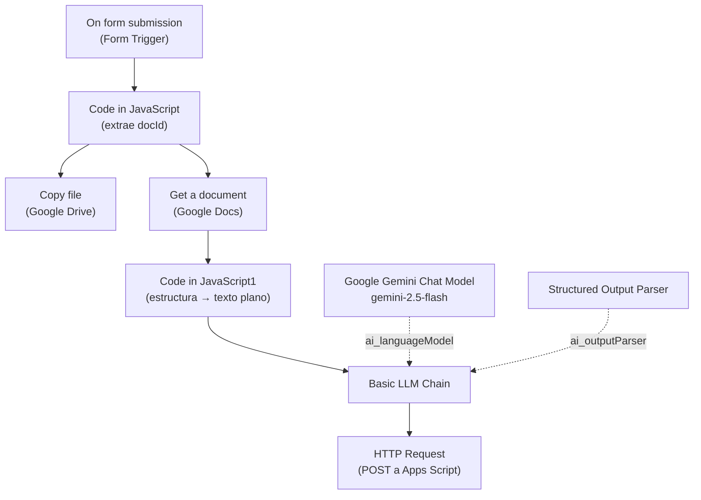

# Informes Coordinación ULO — Workflow de n8n

Workflow de n8n que automatiza el procesamiento de reportes de expertos: un experto llena un formulario con el enlace de su reporte en Google Docs, el workflow hace una copia del documento, lee su contenido, lo analiza con IA (Gemini) y envía el resultado estructurado a un Google Apps Script mediante una petición HTTP.

> **Autor:** _Tu nombre_  
> **Nombre del workflow en n8n:** `Informes Coordinación ULO`  
> **Archivo de exportación:** `Informes_Coordinación_ULO.json`  
> **Estado en el export:** activo (`active: true`)  
> **Última actualización de esta documentación:** 6 de octubre de 2026

---

## Tabla de contenido

1. [Objetivo](#1-objetivo)
2. [Resumen del flujo](#2-resumen-del-flujo)
3. [Tecnologías y servicios](#3-tecnologías-y-servicios)
4. [Diagrama del workflow](#4-diagrama-del-workflow)
5. [Descripción detallada de cada nodo](#5-descripción-detallada-de-cada-nodo)
6. [Conexiones entre nodos](#6-conexiones-entre-nodos)
7. [Flujo de datos paso a paso (con ejemplo)](#7-flujo-de-datos-paso-a-paso-con-ejemplo)
8. [Credenciales requeridas](#8-credenciales-requeridas)
9. [Configuración del workflow](#9-configuración-del-workflow)
10. [Cómo importar y poner en marcha](#10-cómo-importar-y-poner-en-marcha)

---

## 1. Objetivo

Cada vez que un experto termina un reporte en Google Docs, debe completar un formulario. A partir de ese envío, el workflow:

- Genera una **copia** del reporte en Google Drive con un nombre estandarizado (`<Título del reporte> - <Nombre del experto>`).
- **Lee el contenido completo** del documento original (incluyendo texto dentro de tablas).
- Usa **IA (Gemini 2.5 Flash)** para extraer, sin inventar información, cinco campos: título, avances, riesgos (con acción correctiva), indicadores y seguimiento de acuerdos.
- **Envía el resultado en formato JSON** a un Google Apps Script (endpoint web) para su registro o procesamiento posterior.

## 2. Resumen del flujo

| # | Etapa | Nodo |
|---|---|---|
| 1 | Captura del reporte por formulario | `On form submission` |
| 2 | Extracción del ID del documento desde la URL | `Code in JavaScript` |
| 3a | Copia del documento en Drive (rama paralela) | `Copy file` |
| 3b | Lectura del documento con Google Docs (rama principal) | `Get a document` |
| 4 | Conversión de la estructura del documento a texto plano | `Code in JavaScript1` |
| 5 | Análisis con IA y salida estructurada | `Basic LLM Chain` + `Google Gemini Chat Model` + `Structured Output Parser` |
| 6 | Envío del resultado al Apps Script | `HTTP Request` |

## 3. Tecnologías y servicios

| Componente | Uso |
|---|---|
| **n8n** | Orquestación del workflow (versión de ejecución `v1`) |
| **n8n Form Trigger** | Formulario web que inicia el flujo |
| **Google Drive** | Copia del reporte |
| **Google Docs API** (nodo Google Docs) | Lectura del contenido del reporte |
| **Google Gemini** (`models/gemini-2.5-flash`) | Análisis del texto |
| **LangChain en n8n** | Chain LLM + parser de salida estructurada |
| **Google Apps Script** (Web App) | Destino final de los datos (receptor de la petición HTTP POST) |
| **JavaScript** (nodos Code) | Extracción del ID y aplanado del documento |

## 4. Diagrama del workflow



> `Copy file` es una rama paralela que no tiene nodos conectados a su salida.

## 5. Descripción detallada de cada nodo

### 5.1 `On form submission`

| Propiedad | Valor |
|---|---|
| Tipo | `n8n-nodes-base.formTrigger` |
| Versión del nodo | 2.6 |
| Función | Punto de entrada. Publica un formulario web y dispara el workflow al enviarse |

**Configuración**

- **Título del formulario:** `Envío de reporte de experto`
- **Descripción del formulario:** `Completa este formulario cada vez que finalices un nuevo reporte en Google Docs.`
- **Campos** (todos de texto y **obligatorios**):

| Campo | Obligatorio | Descripción |
|---|---|---|
| `Nombre del experto` | Sí | Nombre de quien elaboró el reporte |
| `Título del Reporte` | Sí | Título del reporte (se usa para nombrar la copia) |
| `URL del documento` | Sí | Enlace al Google Doc con el reporte |

- **Opciones adicionales:** ninguna (valores por defecto).

**Salida (JSON):**

```json
{
  "Nombre del experto": "...",
  "Título del Reporte": "...",
  "URL del documento": "...",
  "submittedAt": "...",
  "formMode": "..."
}
```

> Los campos `submittedAt` y `formMode` los agrega n8n automáticamente.

**URLs del formulario:** n8n genera una URL de prueba (`/form-test/<webhookId>`) y una de producción (`/form/<webhookId>`). La de producción solo funciona con el workflow **activo**.

---

### 5.2 `Code in JavaScript`

| Propiedad | Valor |
|---|---|
| Tipo | `n8n-nodes-base.code` |
| Versión del nodo | 2 |
| Lenguaje | JavaScript |
| Función | Extraer el ID del documento de Google Docs a partir de la URL ingresada |

**Código:**

```javascript
const url = $json['URL del documento'];
const match = url.match(/[-\w]{25,}/);
const docId = match ? match[0] : null;

return {
  ...$json,
  docId: docId
};
```

**Cómo funciona:**

1. Lee el valor del campo `URL del documento`.
2. Aplica la expresión regular `/[-\w]{25,}/`, que busca la primera cadena de **25 o más caracteres** compuesta por letras, números, guion bajo (`_`) o guion (`-`). Los IDs de Google Docs (≈ 44 caracteres) cumplen esa condición, mientras que partes de la URL como `docs.google.com` o `document` no.
3. Si encuentra coincidencia, la guarda en `docId`; si no, `docId` queda en `null`.
4. Devuelve **todos los campos originales** del formulario más el nuevo campo `docId`.

**Ejemplo:**

| Entrada | Salida `docId` |
|---|---|
| `https://docs.google.com/document/d/1AbC...XyZ/edit?usp=sharing` | `1AbC...XyZ` |

---

### 5.3 `Copy file`

| Propiedad | Valor |
|---|---|
| Tipo | `n8n-nodes-base.googleDrive` |
| Versión del nodo | 3 |
| Operación | `copy` (copiar archivo) |
| Credencial | `Google Drive account` (`googleDriveOAuth2Api`) |
| Función | Crear una copia del reporte original en Google Drive |

**Parámetros configurados:**

| Parámetro | Valor | Explicación |
|---|---|---|
| `fileId` | `={{ $json.docId }}` (modo `id`) | ID del documento a copiar, tomado del nodo anterior |
| `name` | `={{ $json['Título del Reporte'] }} - {{ $json['Nombre del experto'] }}` | Nombre de la copia: `Título - Experto` |
| `sameFolder` | `false` | La copia **no** se guarda en la misma carpeta que el original |
| `driveId` | Modo `url`, con la URL de una carpeta de Drive (`https://drive.google.com/drive/folders/<ID_CARPETA>?usp=sharing`) | Destino configurado mediante URL de carpeta |
| `folderId` | Modo `list`, valor `root` (`/ (Root folder)`) | Carpeta padre configurada en la raíz |
| `options` | vacío | Sin opciones adicionales |

**Salida:** metadatos del archivo copiado (por ejemplo `id`, `name`, `mimeType`). **Ningún nodo consume esta salida.**

**Ejemplo de nombre generado:** `Informe trimestral de avances - María Pérez`

---

### 5.4 `Get a document`

| Propiedad | Valor |
|---|---|
| Tipo | `n8n-nodes-base.googleDocs` |
| Versión del nodo | 2 |
| Operación | `get` |
| Credencial | `Google Docs account` (`googleDocsOAuth2Api`) |
| Función | Obtener el contenido completo del documento original |

**Parámetros configurados:**

| Parámetro | Valor | Explicación |
|---|---|---|
| `documentURL` | `={{ $json.docId }}` | Se le pasa el **ID** del documento (el nodo acepta ID o URL) |
| `simple` | `false` | Desactiva la salida simplificada y devuelve la **estructura completa** de la API de Google Docs (`title`, `body.content`, etc.), necesaria para el siguiente nodo |

**Salida (estructura simplificada):**

```json
{
  "documentId": "...",
  "title": "Título del documento en Drive",
  "body": {
    "content": [
      { "paragraph": { "elements": [ { "textRun": { "content": "..." } } ] } },
      { "table": { "tableRows": [ { "tableCells": [ { "content": [ ... ] } ] } ] } }
    ]
  }
}
```

---

### 5.5 `Code in JavaScript1`

| Propiedad | Valor |
|---|---|
| Tipo | `n8n-nodes-base.code` |
| Versión del nodo | 2 |
| Lenguaje | JavaScript |
| Función | Convertir la estructura JSON del documento en **texto plano** |

**Código:**

```javascript
const doc = $input.first().json;
let texto = '';

function extraerTexto(content) {
  for (const item of content) {
    if (item.paragraph && item.paragraph.elements) {
      for (const el of item.paragraph.elements) {
        if (el.textRun && el.textRun.content) {
          texto += el.textRun.content;
        }
      }
    } else if (item.table && item.table.tableRows) {
      for (const row of item.table.tableRows) {
        for (const cell of row.tableCells) {
          extraerTexto(cell.content);
        }
      }
    }
  }
}

extraerTexto(doc.body.content);

return [{
  json: {
    titulo: doc.title,
    texto: texto
  }
}];
```

**Cómo funciona:**

1. Toma el primer ítem recibido (`$input.first().json`), que es la respuesta de `Get a document`.
2. Recorre `doc.body.content` con la función recursiva `extraerTexto`:
   - **Párrafos:** concatena el contenido de cada `textRun`.
   - **Tablas:** recorre filas y celdas y vuelve a llamar a `extraerTexto` sobre el contenido de cada celda (por eso el texto dentro de tablas **sí** se extrae).
3. Devuelve un único ítem con:
   - `titulo`: título del documento en Drive (`doc.title`).
   - `texto`: todo el texto concatenado.

**Salida:**

```json
{
  "titulo": "Informe trimestral de avances",
  "texto": "Contenido completo del documento en texto plano..."
}
```

---

### 5.6 `Basic LLM Chain`

| Propiedad | Valor |
|---|---|
| Tipo | `@n8n/n8n-nodes-langchain.chainLlm` |
| Versión del nodo | 1.9 |
| Función | Enviar el texto del reporte al modelo con instrucciones estrictas y obtener un JSON estructurado |

**Parámetros configurados:**

| Parámetro | Valor |
|---|---|
| `promptType` | `define` (prompt definido manualmente) |
| `text` (entrada del usuario) | `={{ $json.texto }}` — el texto plano del reporte |
| `hasOutputParser` | `true` — usa el `Structured Output Parser` conectado |
| `batching` | vacío (valores por defecto) |
| `messages.messageValues` | Un mensaje de instrucciones (ver abajo) |

**Prompt de instrucciones (texto literal):**

```text
Eres un analista que revisa documentos. A partir del texto que recibes, NO lo completes ni inventes contenido. Analiza el texto tal cual está y extrae estrictamente lo siguiente: - titulo: el título o nombre del documento/reporte - avances: resumen breve de avances mencionados en el texto (si no hay, indica "Sin información disponible") - riesgos: lista de riesgos detectados en el texto, cada uno con su acción correctiva (si no hay, deja la lista vacía) - indicadores: resumen de indicadores mencionados (si no hay, indica "Sin información disponible") - seguimiento_acuerdos: acuerdos o próximos pasos mencionados (si no hay, indica "Sin información disponible")  Responde ÚNICAMENTE en el formato JSON solicitado, sin texto adicional, sin inventar información que no esté en el texto.
```

**Reglas que impone el prompt:**

| Campo | Qué debe contener | Valor si no hay información |
|---|---|---|
| `titulo` | Título o nombre del documento/reporte | — |
| `avances` | Resumen breve de avances | `"Sin información disponible"` |
| `riesgos` | Lista de riesgos, cada uno con su acción correctiva | Lista vacía |
| `indicadores` | Resumen de indicadores | `"Sin información disponible"` |
| `seguimiento_acuerdos` | Acuerdos o próximos pasos | `"Sin información disponible"` |

Además exige responder **únicamente** con JSON y **sin inventar** información.

**Conexiones de sub-nodos (entradas de IA):**

- `ai_languageModel` ← `Google Gemini Chat Model`
- `ai_outputParser` ← `Structured Output Parser`

**Salida:** el JSON validado dentro del campo `output`:

```json
{
  "output": {
    "titulo": "...",
    "avances": "...",
    "riesgos": [ { "riesgo": "...", "accion_correctiva": "..." } ],
    "indicadores": "...",
    "seguimiento_acuerdos": "..."
  }
}
```

---

### 5.7 `Google Gemini Chat Model`

| Propiedad | Valor |
|---|---|
| Tipo | `@n8n/n8n-nodes-langchain.lmChatGoogleGemini` |
| Versión del nodo | 1.1 |
| Modelo | `models/gemini-2.5-flash` |
| Opciones | vacías (temperatura y demás parámetros por defecto) |
| Credencial | `Google Gemini(PaLM) Api account` (`googlePalmApi`) |
| Función | Modelo de lenguaje que ejecuta el análisis |

Se conecta al `Basic LLM Chain` mediante la entrada `ai_languageModel`.

---

### 5.8 `Structured Output Parser`

| Propiedad | Valor |
|---|---|
| Tipo | `@n8n/n8n-nodes-langchain.outputParserStructured` |
| Versión del nodo | 1.3 |
| Función | Forzar y validar que la respuesta del modelo siga un esquema JSON |

**Ejemplo de esquema configurado (`jsonSchemaExample`):**

```json
{
  "titulo": "Título del documento",
  "avances": "Texto resumen de avances",
  "riesgos": [
    { "riesgo": "Descripción del riesgo", "accion_correctiva": "Acción propuesta" }
  ],
  "indicadores": "Texto resumen de indicadores",
  "seguimiento_acuerdos": "Texto de acuerdos o seguimiento"
}
```

| Campo | Tipo | Descripción |
|---|---|---|
| `titulo` | texto | Título del documento |
| `avances` | texto | Resumen de avances |
| `riesgos` | arreglo de objetos | Cada objeto tiene `riesgo` y `accion_correctiva` |
| `indicadores` | texto | Resumen de indicadores |
| `seguimiento_acuerdos` | texto | Acuerdos o próximos pasos |

Se conecta al `Basic LLM Chain` mediante la entrada `ai_outputParser`.

---

### 5.9 `HTTP Request`

| Propiedad | Valor |
|---|---|
| Tipo | `n8n-nodes-base.httpRequest` |
| Versión del nodo | 4.5 |
| Método | `POST` |
| URL | `https://script.google.com/macros/s/<DEPLOYMENT_ID>/exec` (Web App de Google Apps Script) |
| Función | Enviar el análisis estructurado al Apps Script |

**Parámetros configurados:**

| Parámetro | Valor |
|---|---|
| `method` | `POST` |
| `url` | URL `/exec` de la Web App de Apps Script |
| `sendBody` | `true` |
| `specifyBody` | `json` |
| `jsonBody` | `={{ $json.output }}` — el objeto JSON producido por el LLM |
| `options` | vacío |

**Cuerpo enviado (ejemplo):**

```json
{
  "titulo": "Informe trimestral de avances",
  "avances": "Se completó el 80 % de las actividades planificadas...",
  "riesgos": [
    { "riesgo": "Retraso en la entrega de insumos", "accion_correctiva": "Reprogramar el calendario con el proveedor" }
  ],
  "indicadores": "Cumplimiento general del 80 %",
  "seguimiento_acuerdos": "Revisar resultados en la próxima reunión"
}
```


## 6. Conexiones entre nodos

| Origen | Salida | Destino | Tipo de conexión |
|---|---|---|---|
| `On form submission` | main | `Code in JavaScript` | main |
| `Code in JavaScript` | main | `Copy file` | main |
| `Code in JavaScript` | main | `Get a document` | main (en paralelo) |
| `Get a document` | main | `Code in JavaScript1` | main |
| `Code in JavaScript1` | main | `Basic LLM Chain` | main |
| `Google Gemini Chat Model` | ai_languageModel | `Basic LLM Chain` | ai_languageModel |
| `Structured Output Parser` | ai_outputParser | `Basic LLM Chain` | ai_outputParser |
| `Basic LLM Chain` | main | `HTTP Request` | main |

`Copy file` no tiene conexiones de salida.

## 7. Flujo de datos paso a paso (con ejemplo)

Los valores siguientes son **ilustrativos**.

1. **Formulario enviado**

   ```json
   {
     "Nombre del experto": "María Pérez",
     "Título del Reporte": "Informe trimestral de avances",
     "URL del documento": "https://docs.google.com/document/d/<ID_DOCUMENTO>/edit"
   }
   ```

2. **`Code in JavaScript`** agrega `"docId": "<ID_DOCUMENTO>"`.
3. **En paralelo:**
   - `Copy file` crea la copia llamada `Informe trimestral de avances - María Pérez`.
   - `Get a document` descarga la estructura completa del documento original.
4. **`Code in JavaScript1`** produce `{ "titulo": "...", "texto": "..." }`.
5. **`Basic LLM Chain`** envía `texto` a Gemini con las instrucciones y recibe el JSON validado por el parser (`output`).
6. **`HTTP Request`** hace `POST` de `output` al Apps Script.

## 8. Credenciales requeridas

Las credenciales **no se incluyen** en el repositorio; cada persona debe crear las suyas en n8n.

| Credencial en n8n | Tipo | Nodo que la usa | Notas |
|---|---|---|---|
| `Google Drive account` | `googleDriveOAuth2Api` | `Copy file` | OAuth2 de Google Drive |
| `Google Docs account` | `googleDocsOAuth2Api` | `Get a document` | OAuth2 de Google Docs |
| `Google Gemini(PaLM) Api account` | `googlePalmApi` | `Google Gemini Chat Model` | API key de Google AI Studio / Gemini |

El nodo `HTTP Request` **no usa credencial** (la URL del Apps Script funciona como endpoint).

**Permisos de la cuenta de Google:** debe tener acceso de **lectura** al documento original (para `Get a document`) y permiso para copiarlo y crear archivos en la carpeta de destino (para `Copy file`).

## 9. Configuración del workflow

| Ajuste | Valor |
|---|---|
| `executionOrder` | `v1` |
| `binaryMode` | `separate` |
| `active` | `true` |
| `pinData` | vacío (sin datos fijados) |
| `tags` | ninguna |

## 10. Cómo importar y poner en marcha

1. En n8n, ve a **Workflows → Import from file** y selecciona `workflows/Informes_Coordinación_ULO.json`.
2. Crea y asigna las tres credenciales de la [sección 8](#8-credenciales-requeridas).
3. En `Copy file`, revisa y ajusta la **carpeta de destino** de Drive a la tuya.
4. Despliega tu propio **Google Apps Script** como *Aplicación web*, copia la URL `/exec` y pégala en el nodo `HTTP Request`.
5. Abre `On form submission` para obtener la URL del formulario y compártela con los expertos.
6. **Activa** el workflow (interruptor *Active*) para que funcione la URL de producción del formulario.
